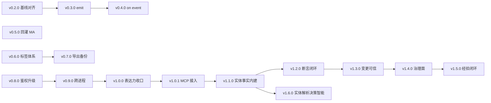

# AutoForge 版本路线图

> 版本：v1.3　日期：2026-09-15
> 依据：`KICKOFF.md` §2-13（G1–G3 必做，G4/G5/G6 backlog）｜`IR_AND_RUNTIME.md` §17（范围）｜§12（P1）｜§15（P2）｜
> **v1.3 增补依据**：`docs/调研_autoflow对照_实体链路.md`、`docs/调研_autoflow对照_全模块.md`（前身 autoflow 全模块调研）
> 状态图例：✅ 完成｜🔨 进行中｜⏸ 待办｜🔮 backlog
>
> **文档结构（v1.1 起）**：
> ① 「里程碑总览」+「G1–G7 各节」= **已发布里程碑（归档，只增不改）**；
> ② 「版本路线图（v0.2.0–v1.6.0）」+「开发计划」= **下一阶段迭代计划**；
> ③ 「不排期项」= 待真实需求驱动、暂不占版本号的候选。

---

## 里程碑总览

| 阶段 | 主题 | 状态 | 完成日期 |
|---|---|---|---|
| **G1** | 最小可运行闭环 | ✅ | 2026-09-14 |
| **G2** | 安全模型与静态扫描完整化（§8.2 全 14 项） | ✅ | 2026-09-14 |
| **G3** | IR 完备性：7 节点 / 6 边 / 两种 Timer 隔离 | ✅（随 G1 落地，G2 收尾） | 2026-09-14 |
| **G4** | MA 置信度分级自主（>0.85 自动 / 0.6–0.85 shadow / <0.6 提案） | ✅ | 2026-09-14 |
| **G5** | 故障注入（unavailable / 网络超时 / 乱序 / 丢包 / 漂移） | ✅ | 2026-09-14 |
| **G6** | 版本审计与 diff | ✅ | 2026-09-14 |
| **G7** | AF-Spec（agent 撰写面，编译到同一份 JSON IR） | ✅ | 2026-09-14 |
| **真机接线** | HA dry_run=False（横切，解锁 G4 canary） | ✅ | 2026-09-14 |
| **UI 服务层** | 只读 HTTP API（FastAPI，11 端点，供前端控制台） | ✅ | 2026-09-14 |
| **UI 服务层 R2** | ask 审批会话（人机回路）+ 真机下发三重闸 | ✅ | 2026-09-14 |
| **UI 服务层 R2+** | 服务层可选鉴权（AUTOFORGE_API_TOKEN 开关，保护写操作 + 真机下发） | ✅ | 2026-09-14 |
| **真机常驻监听** | 订阅 HA SSE 事件流，实时驱动自动化（forge watch） | ✅ | 2026-09-14 |
| **P1 实例持久化** | `persist=true`：实例跨进程 / 崩溃恢复（`run`/`watch --persist-dir`） | ✅ | 2026-09-14 |

---

## G1 —— 最小可运行闭环 ✅

全程内存态。已交付：JSON IR + JSON Schema、TimeSource、EventBus、InstanceManager、AdapterLayer（HA dry-run / HTTP / Mock）、NodeExecutor、Scheduler、StaticScanner（十项）、NL 渲染器与覆盖率检查、`forge build/sim/run`。

- 8 条验收用例全绿；NAS 真 vhass 复核 98 passed
- 详见 `docs/交接卡_G1交付.md`

**G1 交付标准**：6 模块就绪 + `forge build/sim/run` 三子命令；8 条验收全绿；本机 + NAS 真 vhass 双环境全绿；G1 红线（不碰 Node-RED / 不自研仿真器 / 不上原生沙箱 / 不引入持久化跨进程）全部遵守。

## G2 —— 安全模型与静态扫描完整化 ✅

KICKOFF §4.7 明确"延后 G2"的两项 + `IR_AND_RUNTIME` §8.2 十四项补齐。

| # | 检查项 | §8.2 | 级别 | 状态 |
|---|---|---|---|---|
| 1 | 高危动作 L3 + 白名单 | ① | error | ✅ G1 |
| 2 | `ask`/`wait` 缺 `on_timeout` 或 `default` | ② | error | ✅ G1 |
| 3 | 跨自动化实体依赖环检测 | ⑨ | error | ✅ G1 |
| 4 | 静态图内循环（无终止条件） | ④ | error/warning | ✅ G1 |
| 5 | `on_cancel` 分支产生新实例 | ⑤ | error | ✅ G1 |
| 6 | 挂起分支内执行高风险动作 | ⑥ | error | ✅ G1 |
| 7 | Shadow 模式 `do` 写设备 | ⑦ | error | ✅ G1 |
| 8 | 跨自动化读写对方实例私有变量 | ⑧ | error | ✅ G1 |
| 9 | 适配器配置含 IR 未定义策略参数 | ⑬ | error | ✅ G1 |
| 10 | `snapshot=false` + 多条件 AND | ⑩ | warning | ✅ G1 |
| 11 | **实体存在性校验**（引用了不存在的实体） | ⑫ | error | ✅ G2 |
| 12 | **跨自动化实体抢占冲突**（写同一实体且无优先级） | ③ | error | ✅ G2 |
| 13 | **L2 动作强制 canary + 人工确认** | §8.1 | error | ✅ G2 |
| 14 | **低置信度（<0.6）禁止写设备，只能出 ask 提案** | §10 | error | ✅ G2 |
| 15 | 非幂等动作 + `restart`/`parallel` | ⑪ | warning | ✅ G1 |
| 16 | 同节点同优先级边重复定义 | ⑭ | error | ✅ G1 |
| 17 | **`do` 建议有 `on_error`**（缺省直接 failed） | §6 | warning | ✅ G2 |
| 18 | **`on_cancel` 分支禁止再次挂起**（禁止嵌套中断） | §5.3 | error | ✅ G2 |
| 19 | 实体读写权限 ACL | ① | error | ✅ G2 |
| 20 | NL 覆盖率检查 | §14-13 | warning | ✅ G1 |

**G2 交付标准**：上表 11–14、17–19 全部落地并有单测；`forge build --entities <清单>` 能真正校验实体存在性；全量测试（Windows + NAS 真 vhass）保持全绿。

**G2 已达成（2026-09-14）**
- 六项新检查全部落地 + **19 条单测**；`requires_confirm` / `canary` 已进入 IR Schema（唯一真相）
- CLI 新增 `--entities`（实体清单）与 `--acl`（权限表）两个选项
- 补上 G1 遗留的 `scripts/gen_schema_check.py`：8 份样例 8/8 符合"通过/拒绝"预期
- 自测：**本机 115 passed + 3 skipped**；**NAS 真 vhass 118 passed / 0 skip**
- 顺带修正 `case04`（`climate.turn_on` 属 L2，补 `requires_confirm` + `canary`）

## G4 —— MA 置信度分级自主 ✅（2026-09-14）

**主题**：把 KICKOFF §2-11 的三级自主从编译期约束（G2 已落）延伸到运行期。

| 组件 | 职责 |
|---|---|
| `af_conf.py` | `ConfidenceStore`（每自动化一份 conf）、指数衰减 `decay()`、正/负样本回灌（`record_positive`/`record_negative`）、`promote`；`decision_for()` 映射 `auto`/`shadow`/`ask` |
| `af_canary.py` | `CanaryGuard`：动作前快照 + `has_drift()` 漂移检测 + `rollback()` 反向动作回滚；反向表 `INVERSE_ACTION` 由 `SERVICE_STATE` 推导 |
| `af_executor.py` | `do` 节点在 **auto 带 + 标 canary + 非 dry-run** 时走灰度保护；漂移 → 自动回滚 + 审计 `ENTITY_DRIFT` |
| `af_cli.py` | 新增 `forge conf <ir>`：展示各自动化置信度/级别，支持 `--decay-hours` / `--intervene` 模拟 |

**关键约束**
- 阈值与 G2 编译期闸门**共用同一组常量**（`AUTO_MIN=0.85` / `SHADOW_LOW=0.60`），改一处必须同步
- canary **不触发 dry-run 适配器**（G1 默认不写真机，dry-run 不改状态会永远误判漂移）
- 漂移检测读的状态源必须是适配器写入的同一份——`make_harness` 已把 `executor.states` 指向 FakeHA，否则读到旧快照误回滚
- 持久化属 G6：原型期 `ConfidenceStore` 全内存

**自测**：本机 `128 passed + 3 skipped`；`forge conf` 实测 case01 经 240h 衰减+干预后由 auto(1.0) 跌到 shadow(0.817)。G4 单测见 `tests/unit/test_af_conf.py`、`test_af_canary.py`。

## G3 —— IR 完备性 ✅（G2 收尾）

7 节点（`on/if/do/ask/wait/set/pass`）+ 6 边（`then/yes/no/default/on_timeout/on_cancel/on_error`）、两种 Timer 隔离（`for` 持续条件 vs `wait` 实例定时器）已随 G1 落地并经 8 条验收验证。G2 不再重复，仅收尾 `for` 语义的边界用例。

**G3 交付标准**：7 节点 / 6 边 / 两种 Timer 全绿；`for` 持续条件语义（`case02` 取消用例）与 `wait` 实例定时器（`case04` 超时用例）经 8 条验收验证；本机 + NAS 真 vhass 双环境全绿。

## G5 —— 故障注入 ✅（2026-09-14）

**主题**：IR §9.5 五类故障（`unavailable` / 网络超时 / 事件乱序 / 消息丢包 / 状态漂移）+ IR §9.4 四类失败落执行器断言。

| 组件 | 职责 |
|---|---|
| `af_fault.py` | `FaultKind`/`FaultSpec`/`FaultPlan` + 注入原语（状态层 / 适配器层 / 事件层）+ `FOUR_FAILURES` 映射 |
| `af_adapters/base.py` | `FaultQueue`：适配器层故障队列（timeout/drop/unavailable/fail） |
| `af_adapters/{mock,ha}.py` | 适配器接入故障队列（`*_next`），仍单次下发不重试 |
| `af_vhass/{fake,harness}.py` | FakeHAAdapter 接故障队列；vhass 补 `register_unavailable` + 乱序重放 `replay(seed=)` |
| `tests/{unit,acceptance}/test_*fault*` | 10 单测 + 12 验收（FakeHA）+ 2 真 vhass 复核 |

**关键约束**
- 五类故障的注入层：`unavailable`/`drift` = 状态层；`timeout`/`drop` = 适配器层；`reorder` = 事件层。同 spec 不跨层重复注入。
- 四类失败落点（IR §9.4）：设备故障→`on_error`+`action_failed`；超时→`on_timeout`；取消→`on_cancel`（不回滚）；业务拒绝→`no`/`default`。
- 故障注入**只作用于测试底座**，生产 Runtime 主链路零改动；适配器纯执行层红线未破。

**自测**：本机 150 passed / 5 skipped；NAS 真 vhass **155 passed**。详见 `docs/交接卡_G5故障注入.md`。

## 真机 HA 接线 ✅（2026-09-14，横切，与 G5 并行）

**主题**：把 G1 默认的 `dry_run=True` 接到真实 HA，解锁 G4 canary 的真实价值（**canary 仅在非 dry-run 生效**）。

| 组件 | 职责 |
|---|---|
| `af_adapters/ha.py` | `HATransport`（REST 下发 + Bearer 鉴权 + 传输层超时）、`HAStateProvider`（REST 状态源） |
| `af_scanner.py` | `live_preflight`：缺令牌 / 缺二次确认 / 缺白名单 / 写目标越界 → 拒绝下发 |
| `af_cli.py` | `forge run --live --confirm --ha-token … --live-allow …`；`sim --live` 忽略并告警 |

**关键约束**
- 真机写设备**必须**白名单 + 二次确认；`--live-allow` 可把可写子集收窄到单个实体（先不开放全量）。
- 适配器仍纯执行层：传输层套接超时保留，语义层重试/降级仍归 IR（红线未破）。
- 无事件不下发（CLI 回放式退出）；常驻监听属后续话题。

**自测**：本机 165 passed / 5 skipped；NAS 真 vhass **170 passed**。详见 `docs/交接卡_真机接线.md`。

## UI 服务层 ✅（2026-09-14，Round 1 只读）

**主题**：为前端控制台（`AutoForge-UI`）提供只读 HTTP 取数面，落地《AutoForge-UI 开工令》附录 A 契约。

| 组件 | 职责 |
|---|---|
| `af_service.py` | 服务层纯逻辑（无 Web 依赖）：11 个能力函数 + `bootstrap_examples` |
| `af_api.py` | FastAPI 路由层（CORS、错误码映射、Pydantic 请求体）；自带 `/docs` 与 `/openapi.json` |
| `af_cli.py` | `forge serve --host --port --store-root --examples` |
| `docker/Dockerfile.api` + `docker-compose.api.yml` | NAS 部署（端口 8787，归档挂 `/vol1/1000/docker/autoforge-store`） |

**关键约束**
- **只读**：不连真实 HA、不写设备、不需要令牌；`/sim` 只在本地 FakeHA 内运行。
- 端点：health / graphs / graphs{name} / build / sim / conf / conf.intervene / diff / spec / spec.compile / faults。
- 契约权威形态 = `GET /openapi.json`；速查表见 `docs/API_CONTRACT.md`。
- Round 2（ask 审批、真机下发）未实现，前端先做 disabled 占位。

**自测**：本机 202 passed / 5 skipped；NAS 服务层容器端点自测 **13/13 PASS**，局域网 `http://192.168.2.200:8787` 可达。详见 `docs/交接卡_API服务层.md`。

## UI 服务层 Round 2 ✅（2026-09-14）

**主题**：把"只读控制台"升级为可交互的**审批台**——ask 人机回路 + 受闸门保护的真机下发。

| 组件 | 职责 |
|---|---|
| `af_service.py` | 进程内**会话**（`create/list/get/answer/tick/cancel/delete`，TTL `AUTOFORGE_SESSION_TTL_S`）；**真机下发** `live_status`/`live_run`（三重闸） |
| `af_api.py` | `/api/sessions*`（7 个）、`/api/live/status`、`/api/live/run`；统一 `ServiceError → status` 映射 |

**关键约束**
- `ask` 需要"挂起 → 应答 → 继续"的跨请求状态 → 引入**进程内会话**（内存、单进程；服务重启丢失，原型期足够）。
- 真机下发**三重闸**（缺一即拒）：服务端 `AUTOFORGE_LIVE_ENABLED=1`（默认关）＋ 服务端 `AUTOFORGE_HA_TOKEN`（**绝不从请求体收令牌**）＋ 请求体 `confirm=true` + 非空 `live_allow` 且 IR 写目标 ⊆ 白名单。
- 真机路径与 CLI `forge run --live` 同口径（复用 `live_preflight` 语义）；服务端打 `LIVE RUN` 告警日志。
- 服务层仍**无鉴权**（仅局域网原型）；暴露到 tailnet/公网前必须加认证，真机下发尤其。

**自测**：本机 211 passed / 5 skipped；NAS 真服务实测 —— `live/status` 给出双闸原因；会话 `asks=1(room=study)` → 应答"好"→ `climate.study=cool` 且 ask 清零 → delete ok；`live/run` 未启用时 **403**。

## 真机常驻监听 ✅（2026-09-14，收口「后续」项）

**主题**：把 `forge run --live` 的"回放式一次性执行"升级为"常驻运行"——持续订阅 HA 的
SSE 事件流（`GET /api/stream`），把每个 `state_changed` 实时转成 `BusEvent` 喂给
`Runtime.publish`，并周期性 `runtime.tick()` 驱动 `for` 持续条件与 `wait` 实例定时器。

| 组件 | 职责 |
|---|---|
| `af_live.py` | `iter_sse_blocks`（纯函数 SSE 帧解析）、`parse_ha_event`（块→`BusEvent`）、`HAEventStream`（订阅/重连）、`run_watch`（事件驱动主循环）、`start_ticker`（后台 tick 守护线程） |
| `af_cli.py` | `forge watch`（强制 `--confirm` + 令牌 + 白名单，复用 `live_preflight`；Ctrl+C 优雅退出） |

**关键约束**
- **零新增依赖**：SSE 用标准库 `urllib` 流式读取，复用 `HATransport` 的 opener 与鉴权头。
- **纯执行层不变**：本模块只采集 + 投递事件，不下发动作；下发仍走 `do` → `HAAdapter(dry_run=False)`，受 G2 静态闸 + G4 canary + 真机三重闸约束。
- **安全优先**：常驻监听会**持续**真实操作 HA，因此 `forge watch` 强制 `--confirm`（缺省拒绝启动），与 `run --live` 同口径。
- **韧性**：SSE 断流/异常后按退避重连（默认无限重连，可配 `max_retries`）。
- **可测**：解析与投递逻辑均为纯函数/可注入迭代器，15 条单测零网络。

**自测**：`tests/unit/test_af_live.py` 15 passed（SSE 解析 / `run_watch` 投递与停止 / 重连 / `start_ticker`）；全量 **214 passed / 5 skipped** 无回归。

## 服务层可选鉴权 ✅（2026-09-14，R2 收口项）

**主题**：R2 收口卡标注"暴露到 tailnet/公网前必须加认证"，本项落实最小实现。

| 组件 | 职责 |
|---|---|
| `af_api.py` | `_require_auth`（`HTTPBearer(auto_error=False)` + 环境变量 `AUTOFORGE_API_TOKEN` 开关）；应用到 7 个受保护端点（会话写 + 真机下发）；读端点始终开放 |

**关键约束**
- **默认关闭**：未设 `AUTOFORGE_API_TOKEN` 时行为与改造前一致，不破坏局域网无鉴权联调。
- 仅保护**写操作 + 真机下发**；`GET /api/sessions`、`/api/graphs` 等读端点不受鉴权影响。
- 单一共享密钥（原型期足够）；多用户/撤销/限速后续可参照 memory-agent 的 A2/A4 方案升级。

**自测**：`tests/unit/test_af_api.py` 新增 3 条鉴权测试（默认不强制 / 设令牌后 403 / 读端点始终开放）；全量无回归。

## P1 实例持久化与崩溃恢复 ✅（2026-09-14，P1 首个落地项）

**主题**：把 Runtime 从"单进程内存态"升级为**可续跑**——`persist=true` 的自动化的
活跃/挂起实例跨进程重启（含崩溃）后自动恢复，消除"`watch` 进程退出即丢活跃实例"。

| 组件 | 职责 |
|---|---|
| `af_persist.py` | `PersistStore`（`{root}/instances/{id}.json`，`os.replace` 原子写）、`record_instance` / `restore_instance`（定时器墙钟 ⇄ 单调换算） |
| `af_instance.py` | `InstanceManager.attach()`（恢复挂载 + 重取快照）、`on_change` 变更回调 |
| `af_runtime.py` | `persist_dir` 字段、`_on_instance_change`（非终态落盘 / 终态清除）、`restore_persisted()`（启动恢复 + 丢弃审计） |
| `af_cli.py` | `forge run` / `forge watch` 新增 `--persist-dir` |

**关键约束**
- 只持久化**非终态**实例；终态即删除。恢复的实例**状态不变**，快照按 IR §7.1 **重取**。
- **定时器用墙钟存**（`due_at_wall`）：`monotonic()` 重启归零、跨进程不可比；恢复时换算回新单调时钟，
  **崩溃期间错过的超时**在恢复后首次 `tick()` 立即触发 `on_timeout`。
- 丢弃规则显式可审计（自动化不在当前图 / `persist` 已关 / 落盘为终态）→ 删文件 + `instance_restore_dropped`。
- 不传 `--persist-dir` 时行为**完全等同**原型期内存态（零回归）；`emit`/`fn` 仍为保留位。

**自测**：`tests/unit/test_af_persist.py` 11 passed；全量 **225 passed / 5 skipped** 无回归。
详见 `docs/交接卡_实例持久化.md`。

## G6 —— 版本审计与 diff ✅（2026-09-14）

**主题**：Graph 可寻址 + 版本化存储 + 置信度持久化 + `forge diff`。

| 组件 | 职责 |
|---|---|
| `af_store.py` | `GraphStore`（`{root}/{name}/v{n}.json` 版本归档）、`dump_confidence`/`load_confidence`、`instance_record`/`restore_context`、`find_node`、`diff_graphs`/`GraphDiff` |
| `af_cli.py` | `forge diff <a> <b>`（节点/边/参数/元信息级）；`forge store save/log` |

**关键约束**
- 存储全 JSON 文件、无外部依赖；实例沿用 `Instance.to_dict()`（可序列化红线）。
- `diff_graphs` 按 `node.raw` 字段级比对；边按 `(from,to,kind)` 集合比对；元信息比对 `mode/version/confidence/snapshot/persist/meta`。
- 并发写保护属 P1 跨进程话题（原型期单写者）。

**自测**：本机 179 passed / 5 skipped；NAS 真 vhass **184 passed**。详见 `docs/交接卡_G6版本审计.md`。

## G7 —— AF-Spec ✅（2026-09-14）

**主题**：IR 已冻结（v0.2.1）后，为 Agent 提供文本撰写面，编译到**同一份 JSON IR**（Spec 是投影，Graph 才是模型）。

| 组件 | 职责 |
|---|---|
| `af_spec.py` | `compile_spec`（文本 → IR → Graph，经 Schema 校验）、`render_spec`（Graph → 文本）、`graph_to_raw` |
| `af_cli.py` | `forge spec compile/render` |

**关键约束**
- **零有损往返**：渲染只写 IR 中出现过的字段，解析只在 token 出现时填字段 → `compile_spec(render_spec(g))` 与 `g` raw 级一致。
- 覆盖全部 7 节点 / 6 边；结构化子对象用内联 JSON；`reserved` 节点拒绝渲染。
- 表达式求值仍唯一由 `af_ir.expr` 决定（不引入第二套语义）。

**自测**：本机 190 passed / 5 skipped；NAS 真 vhass **195 passed**（含 8 份样例往返 + NL 逐字对齐）。详见 `docs/交接卡_G7_AF-Spec.md`。

---

## 版本路线图（v0.2.0–v1.6.0）

> 本表为**下一阶段迭代计划**；上方 G1–G7 与各横切项为已发布里程碑（归档，只增不改）。
>
> **版本号规则**：minor 版本 = **一个可独立验收的主题**（3–5 个交付点）；patch 版本 = 缺陷修复。
> **禁止**把多个主题塞进同一个版本号——这是本路线图与旧版（`v1.1 / v1.2 / v2.0` 笼统分法）的根本区别。
>
> **当前版本**：`1.6.0`（实体解析决策智能 ✅ 2026-09-16）｜**已插队**：`v1.6.0-a` 数据源升级（✅ 2026-09-16）
> **回归基线（v1.6.0 起）**：本机 **488 passed / 10 skipped**（collected 498；v1.6.0 新增 21 条）。
> **NAS 双环境全绿**（DoD#4，2026-09-17）：容器 `autoforge-api` 全量回归 **488 passed / 10 skipped / 0 failed**——与本机**完全一致**；部署复核 `/api/health` 等端点 200。
> **下一阶段**：串行主链 `v1.1.0–v1.6.0` **全部交付**；**v1.7.0「WebUI 全功能接入」已规划**（把后端 47 端点 / 24 MCP 工具中需用户操作的能力完整展现到 `autoforge-ui` 控制台，分 A/B/C 三批，详见 `docs/开发计划_WebUI全功能接入.md` + 本章同名章节）；后续按需（C §3 弱信号深化 / 新需求）。
> v1.1.0 交付 +27 条（`tests/unit/test_v1_1_catalog.py`）、v1.2.0 交付 +22 条（`tests/unit/test_v1_2_expect.py`）。
> **NAS 复核**：本次为本机改动，`e:/NAS/AutoForge` 是断开副本——`E:\NAS` 与 NAS 已断开（`net use e:` 报 "The network connection could not be found"），
> 部署须 `scp` 到 `/vol1/1000/docker/autoforge/src` 后 `docker restart autoforge-api`。**待执行**。

| 版本 | 主题 | 规模 | 依赖 | 状态 |
|---|---|---|---|---|
| v0.2.0 | 基线对齐与欠账清理 | S | — | ✅ 2026-09-15 |
| v0.3.0 | 跨自动化事件 · 发布侧 `emit` | M | — | ✅ 2026-09-15 |
| v0.4.0 | 跨自动化事件 · 订阅侧 `on event` | M | v0.3.0 | ✅ 2026-09-15 |
| v0.5.0 | 运行指标回灌 MA（生态闭环） | M | — | ✅ 2026-09-15 |
| v0.6.0 | 标签体系与批量启停 | S | — | ✅ 2026-09-15 |
| v0.7.0 | 模板导出与备份恢复 | S | v0.6.0 | ✅ 2026-09-15 |
| v0.8.0 | 服务层鉴权升级 | M | — | ✅ 2026-09-15 |
| v0.9.0 | 跨进程与多写者 | L | v0.8.0 | ✅ 2026-09-15 |
| v1.0.0 | 表达力收口（表达式强化 + `fn` 评估） | M | v0.9.0 | ✅ 2026-09-15 |
| v1.0.1 | Agent 接入（MCP stdio server） | S | v1.0.0 | ✅ 2026-09-15 |
| **v1.1.0** | **实体事实内建**（设备目录 + 解析，切断对 MA 的硬依赖） | M | v1.0.1 | ✅ 2026-09-16 |
| **v1.2.0** | **断言闭环**（IR 期望值 + sim 断言 + 诊断可行动） | M | v1.1.0（`af_affordance`） | ✅ 2026-09-16 |
| **v1.3.0** | **变更可信**（diff 签名兜底 + 爆炸半径 + 归档归属） | S | v1.2.0 | ✅ 2026-09-16 |
| **v1.4.0** | **治理面**（待批队列 + 设备保护分级 + 凭据热重载） | M | v1.3.0 | ✅ 2026-09-16 |
| **v1.5.0** | **经验闭环**（失败归因 + 错误知识库 + 实体共现 + 解析遥测/消歧） | L | v1.4.0 | ✅ 2026-09-16 |
| **v1.6.0** | **实体解析决策智能**（数据源 + 归并/优选/别名/弱信号 + 可选 binding） | M | v1.1.0 | ✅ 2026-09-16 |
| **v1.7.0** | **WebUI 全功能接入**（后端 47 端点 / 24 MCP 工具能力完整展现到控制台） | L | v1.6.0 | 🔨 计划中 |

---

### v0.2.0 — 基线对齐与欠账清理 ✅（2026-09-15）

**主题**：把"本机绿 / NAS 未知"拉平，清掉验收暴露的欠账。**必须最先做**——后续所有版本都以"双环境绿"为验收基线。

**交付结果**：本机 **226 passed / 9 skipped**；NAS 真 vhass **235 passed / 0 skipped**（**collected 一致 = 235**；本机 skip 的 9 条 vhass 专用用例已在 NAS 实跑通过）。详见 `docs/交接卡_v0.2.0_基线对齐.md`。

| # | 交付点 | 落点 |
|---|---|---|
| 1 | NAS 真 vhass **全量回归**，对齐本机 225 条 | `docker/Dockerfile.test`；`docker run --rm -v /vol1/1000/docker/autoforge:/app autoforge-test` |
| 2 | **vhass 适配器层故障接入**（消除已知残留） | `src/autoforge/af_vhass/bridge.py`：`HassAdapter` 接入 `FaultQueue`（对齐 `af_adapters/{mock,ha}.py`） |
| 3 | 前端口径统一 + Diff 比对字段确认 + 示例置信度观感 | `AutomationsListView.vue` 的 `conf('_all')` 与 `ConfidenceView.vue` 的 `conf('all')` 统一；`af_store.diff_graphs` 明确 `note`/`meta` 是否纳入比对 |
| 4 | 文档同步 | 本文件、`README.md`、`KICKOFF.md`、交接卡 |

**退出标准**：本机与 NAS 测试条数一致且全绿；前端 9 页复验 0 console 错误。
**规模**：S　**依赖**：—

---

### v0.3.0 — 跨自动化事件 · 发布侧 `emit` ✅（2026-09-15）

**主题**：让自动化能"广播事件"（IR 完备性收官之一）。

**交付结果**：本机 **237 passed / 9 skipped**；NAS 真 vhass **246 passed / 0 skipped**（collected 一致 = 246）。
`emit` 采用**节点字段**形态（不新增第 8 种 kind），走总线**独立通道**（`event.<name>` / `source="emit"`）；
新增扫描检查 `EMIT_SELF_LOOP`（error 自触发环）与 `EMIT_STORM_LIMIT`（warning 风暴上限）。详见 `docs/交接卡_v0.3.0_emit.md`。

| # | 交付点 | 落点 |
|---|---|---|
| 1 | IR Schema：`emit` 由保留位 → **正式节点**（事件名 / 载荷 / 可选延迟） | `af_ir/schema/ir.schema.json`、`af_ir/models.py`（移出 `_RESERVED_NODE_KEYS`） |
| 2 | `emit` 执行：投递到 EventBus（复用去重 / 节流 / 熔断） | `af_executor.py` |
| 3 | 扫描器：放行 `emit` + **自触发环检测** + **事件风暴上限** | `af_scanner.py`（移除 `RESERVED_NOT_IMPLEMENTED` 拦截，新增两项检查） |
| 4 | NL 渲染 + AF-Spec 往返 | `af_nl.py`、`af_spec.py`（`reserved` 判定同步） |

> **注意**：IR 的 `emit` 节点 ≠ `Runtime.emit(entity_id, state, …)`（后者是向总线投递**状态事件**的现有方法）。本版需在总线层支持"**非实体自定义事件**"语义。

**退出标准**：`examples/ir/case09_emit.json` 通过 `forge build`；`tests/unit/test_af_emit.py` 全绿。
**规模**：M　**依赖**：—

---

### v0.4.0 — 跨自动化事件 · 订阅侧 `on event` ✅（2026-09-15）

**主题**：让自动化能"响应事件"，与 v0.3.0 形成闭环。

**交付结果**：本机 **246 passed / 9 skipped**；NAS 真 vhass **255 passed / 0 skipped**（collected 一致 = 255）。
`on event` 以 **trigger 类型** 实现（`{"type": "event", "event": "<name>"}`，非新节点 kind），
按 `event.<name>` 精确匹配（无通配符）；闭环样例 `examples/ir/case10_emit_on_event.json` 端到端通过。详见 `docs/交接卡_v0.4.0_on_event.md`。

| # | 交付点 | 落点 |
|---|---|---|
| 1 | 新增 `on event` 触发类型 | `af_executor.py`、`af_scheduler.py` |
| 2 | 事件过滤（来源 automation / 字段匹配） | `af_executor.py` |
| 3 | 跨自动化依赖图纳入**事件边** + 环检测 | `af_scanner.py`（扩展依赖矩阵） |
| 4 | NL + AF-Spec 往返 + **端到端协作用例**（A `emit` → B `on event`） | `af_nl.py`、`af_spec.py`、`tests/acceptance/` |
| 5 | Web 控制台展示事件链路 | `Autoforge-UI` |

**退出标准**：`case09` 跨自动化闭环通过。
**规模**：M　**依赖**：v0.3.0

---

### v0.5.0 — 运行指标回灌 MA（生态闭环）

**主题**：AF 执行结果回流 memory-agent，形成"假设 → 验证 → 校准"闭环。

| # | 交付点 | 落点 |
|---|---|---|
| 1 | 指标聚合：执行次数 / 成功率 / 审计分布 / 置信度变化 | `af_metrics.py` [NEW] |
| 2 | 回灌客户端：幂等 + 退避 + **离线缓冲**（JSONL 落盘，恢复续传） | `af_metrics.py` |
| 3 | 与 MA 契约对齐（复用 butler 白名单，新增 metrics ingestion） | 契约文档 + MA 侧 |
| 4 | CLI `forge metrics push` + API `GET /api/metrics` | `af_cli.py`、`af_api.py`、`af_service.py` |

**退出标准**：AF 执行 → MA 可查到对应指标；断网缓冲不丢、恢复续传。
**规模**：M　**依赖**：—

**交付结果（2026-09-15）**：
- `af_metrics.py` [NEW]：`MetricsAggregator`（聚合执行次数 / 成功率 / 审计分布 / 置信度变化）+ `Ingester`（幂等 `dedupe_key` + 指数退避 + JSONL 离线缓冲 + 恢复续传）。
- Runtime 新增执行计数（`_exec_stats`：实例 `on_spawn` / `on_terminal` 回调，零侵入实例生命周期）。
- 服务/接口：`get_metrics()` + `GET /api/metrics`（验收视角读端点）；`forge metrics show` / `push`（CLI）。
- 契约 `docs/MA_METRICS_CONTRACT.md`；MA 侧已在 NAS `memory-agent` 加 `POST /api/metrics/ingest` + `GET /api/metrics`（复用 butler 白名单）。
- 测试 `tests/unit/test_af_metrics.py`（聚合 / 幂等 / 退避 / 离线缓冲 / CLI / API，11 条）。
- **真机闭环验证**：`forge metrics push case01_day_light.json --ma-url http://192.168.2.200:8086 --token <butler>` → `sent:1`；MA `GET /api/metrics` 真实返回 `study_day_light` 指标（confidence=1.0，`auto`）。退出标准达成。

---

### v0.6.0 — 标签体系与批量启停

**主题**：从"单条管理"到"按组治理"。

| # | 交付点 | 落点 | 状态 |
|---|---|---|---|
| 1 | `GraphStore` 支持 `tags` 元数据（侧车 `tags.json` 索引，覆盖式设置） | `af_store.py` | ✅ |
| 2 | IR 模型加 `enabled` 开关；运行时（`Scheduler.handle_event`/`_drain_queues`）静默跳过禁用项 | `af_ir/models.py`、`af_scheduler.py`、`af_ir/schema/ir.schema.json` | ✅ |
| 3 | CLI：`forge store tag` / `forge store tags` / `forge store enable\|disable --tag` | `af_cli.py` | ✅ |
| 4 | API：`GET /api/graphs?tag=` + `POST /api/graphs/tags` / `enable` / `disable`（按标签批量翻转并落新版本） | `af_api.py`、`af_service.py` | ✅ |
| 5 | 前端：标签列 + 筛选 + 批量操作 | `Autoforge-UI`（独立仓库，随 UI 迭代；后端契约已就绪） | 🔮 |

**退出标准**：一键停用某标签下全部自动化（后端已达成：按 tag 批量翻转 `enabled` 并保存新版本）。
**规模**：S　**依赖**：—
**附**：本迭代并行修复缺陷——EventBus 200ms 节流误杀真实状态跳变（改为状态感知），见 `docs/handoff_lamp_sync_throttle.md`，属 v0.5.x 补丁。本机 278 passed / 10 skipped 全绿。

---

### v0.7.0 — 模板导出与备份恢复 ✅（2026-09-15）

**主题**：可携带、可回滚的 Graph 资产。

| # | 交付点 | 落点 | 状态 |
|---|---|---|---|
| 1 | `forge store export/import`（bundle 版本化 + 校验和） | `af_store.py`、`af_cli.py` | ✅ |
| 2 | 导入前 Schema 校验 + 冲突策略（跳过 / 覆盖 / 重命名） | `af_store.py` | ✅ |
| 3 | API 入口（`GET /api/store/export` + `POST /api/store/import`） | `af_api.py`、`af_service.py` | ✅ |
| 4 | 前端入口（Autoforge-UI 独立仓库，随 UI 迭代；后端契约已就绪） | `Autoforge-UI` | 🔮 |

**交付结果（2026-09-15）**：
- `af_store.export_bundle()`：导出整个 store 为自描述 JSON bundle（含每个归档的全部版本 + tags + 置信度快照），`checksum` 字段 = 对规范化 entries/confs 做 SHA256，可侦测传输/存储损坏。
- `af_store.import_bundle(bundle, strategy)`：`format` + `checksum` 校验（损坏即拒）；逐版本 IR Schema 校验（非法版本记入 `errors` 不落地）；冲突策略 `skip`（默认最安全）/ `overwrite`（删后重置版本）/ `rename`（`name_import`/`name_import2`…）。
- `forge store export --out` / `forge store import <file> --strategy` 两个 CLI 子命令。
- `GET /api/store/export`（读端点）+ `POST /api/store/import`（写操作，受 `AUTOFORGE_API_TOKEN` 鉴权）两个端点。
- 测试 `tests/unit/test_v0_7_export_import.py`（11 条）：导出→清空→导入 raw 级一致（多版本 + tags + 校验和）/ 篡改被拒 / 非法版本不落地 / 三种冲突策略 / CLI / API。
- **本机 289 passed / 10 skipped 全绿**（较 v0.6.0 基线 278 +11 条新测）。

**退出标准**：导出 → 清空 → 导入，raw 级一致（逐版本 graph dict 规范化比对相等）；冲突策略生效。✅ 已达成。
**规模**：S　**依赖**：v0.6.0（tags 进 bundle，导出一并携带）

---

### v0.8.0 — 服务层鉴权升级

**主题**：从单一共享密钥升级为可撤销、可限速、可分级的令牌体系。

| # | 交付点 | 落点 | 状态 |
|---|---|---|---|
| 1 | 多令牌 / 主体模型（token → subject + scope） | `af_auth.py`、`af_api.py` | ✅ |
| 2 | 令牌撤销（jti 黑名单） | `af_auth.py`、`af_api.py`、`af_cli.py` | ✅ |
| 3 | 限速（IP + 主体双维度） | `af_auth.py`、`af_api.py` | ✅ |
| 4 | 端点分级 scope：`read` / `write` / `live` | `af_api.py` | ✅ |

**现状**：当前为单一 `AUTOFORGE_API_TOKEN` 共享密钥，仅保护写操作 + 真机下发（见「服务层可选鉴权」节）。
**退出标准**：撤销即时生效；超限 429；越权 403。
**规模**：M　**依赖**：—
**交付（2026-09-15）**：新增 `af_auth.py` 鉴权引擎（`TokenRegistry` + `RateLimiter`）；
`AUTOFORGE_TOKENS` JSON 多令牌注册表（旧 `AUTOFORGE_API_TOKEN` 平滑映射为 shared 全 scope）；
撤销黑名单内存 + 落盘 `{store_root}/.auth/revoked.json`（重启恢复，`POST /api/auth/revoke` 即时生效）；
限速 IP + 主体双维度固定窗口（`AUTOFORGE_RATE_LIMIT_PER_MIN`，默认 1000/min）；
端点三级 scope：read 公开 / write（标签·启停·import·会话·干预·auth 管理）/ live（真机下发）；
管理端点 `GET /api/auth/whoami`、`GET /api/auth/subjects`、`POST /api/auth/revoke`；
CLI `forge auth list / revoke`。未配置任何令牌时全站公开（向后兼容）。

---

### v0.9.0 — 跨进程与多写者

**主题**：Runtime 从单进程内存态走向多进程安全。

| # | 交付点 | 落点 | 状态 |
|---|---|---|---|
| 1 | `GraphStore` 文件锁（flock / portalocker） | `af_flock.py`（新）、`af_store.py` | ✅ |
| 2 | 实例归属（owner）与租约仲裁 | `af_instance.py`、`af_persist.py`、`af_runtime.py` | ✅ |
| 3 | 多实例 `forge watch` 协调 | `af_live.py`、`af_cli.py` | ✅ |
| 4 | 冲突审计（`write_conflict`） | `af_audit.py`、`af_store.py` | ✅ |

**退出标准**：两进程并发写同图无损坏；冲突可审计。
**规模**：L　**依赖**：v0.8.0（需鉴权区分写者）
**交付（2026-09-15）**：新增 `af_flock.py` 跨进程原语（`FileLock`：fcntl/msvcrt 双实现 + `owner_id()`，
进程死亡内核自动释放无陈旧锁；持有者信息写 sidecar 绕开 Windows 锁读限制）。
`GraphStore.save` 锁内自增版本号 + 原子替换（tmp + os.replace），`expect_version` 乐观锁冲突落
`{root}/write_conflicts.jsonl` 审计并抛 `WriteConflictError`；`set_tags` 读改写整体加锁；
conf / tags 写全部原子化。实例归属：`InstanceContext.owner` 字段 + 落盘记录带 `owner` /
`lease_until_wall` 租约（持有进程每次落盘续租），`PersistStore.claims()` 仲裁（无主/自持/过期可接管），
Runtime 恢复跳过租约未到期的他属实例并审计 `instance_lease_held`（不删文件、不双跑）。
多实例 watch：`af_live.WatchCoordinator` 抢 `{persist_dir|store_root}/watch.lock`，
第二实例拒绝启动并打印持有者诊断。零新增外部依赖。

---

### v1.0.0 — 表达力收口（表达式强化 + `fn` 评估）

**主题**：在"不越安全边界"的前提下增强表达力，并给出 `fn` 节点的引入结论。

| # | 交付点 | 落点 | 状态 |
|---|---|---|---|
| 1 | 内置表达式函数库扩充（math / string / time / list） | `af_ir/expr.py`、schema operand、scanner | ✅ |
| 2 | 求值复杂度 / 深度上限（防 DoS） | `af_ir/expr.py` | ✅ |
| 3 | `fn` 节点**设计评估报告**（CEL / Lua 是否引入、沙箱边界、与 L3 安全闸的关系） | `docs/fn_节点设计评估.md` | ✅ |
| 4 | 全量回归 + 1.0 发布说明 | 本文件 + `README.md` | ✅ |

**退出标准**：新函数求值正确；无安全回归；双环境全绿。
**规模**：M　**依赖**：v0.9.0
**交付（2026-09-15）**：operand 第三形态 `{"fn": ..., "args": [...]}`（schema `additionalProperties`
仍锁定，仅白名单函数）；24 个纯函数四族（math/string/time/list，时间函数作用于显式 ISO 时间戳，
"表达式不读时钟"红线不破，`time_between` 跨午夜窗口原生支持）；`MAX_EXPR_DEPTH=32` /
`MAX_EXPR_NODES=256` 双硬顶，编译期 `check_expr`（安全闸新诊断 `EXPR_INVALID`，fail-closed）与
运行期 `evaluate` 同一套；`collect_var_refs/entity_refs` 深入 fn 参数（ACL/未声明变量检查不漏）。
`fn` 节点（自定义代码）**保持保留位不引入**，结论见 `docs/fn_节点设计评估.md`。
全量回归本机 323 passed / 10 skipped，NAS 容器 323 passed / 0 failed。
**至此路线图 v0.2.0–v1.0.0 十个小版本全部交付。**

### v1.0.1 — Agent 接入（MCP stdio server）

**主题**：把现有功能（v0.2.0–v1.0.0）以 MCP 工具形式暴露给 Agent，让 agent 真实驱动端到端验证。

| # | 交付点 | 落点 | 状态 |
|---|---|---|---|
| 1 | 零依赖 MCP stdio server（兼容 2024-11-05，逐行 JSON-RPC） | `af_mcp.py` | ✅ |
| 2 | 16 个高内聚工具（build / compile / sim / 归档(save) / 标签 / 启停 / 导出导入 / diff / live / whoami） | `af_mcp.py` | ✅ |
| 3 | 复用 v0.8.0 `TokenRegistry` 在工具层落实 scope 门（写/live 受控） | `af_mcp.py` | ✅ |
| 4 | `forge mcp` 子命令 + agent 接入文档 | `af_cli.py`、`README.md` | ✅ |

**退出标准**：agent 端可列工具并成功调用；写工具在只读令牌下被拒（复用 v0.8.0 凭证语义）。
**规模**：S　**依赖**：v1.0.0
**交付（2026-09-15）**：`af_mcp.py` 进程内直调 `af_service`（与 REST 同源逻辑，不绕安全闸）；
15 工具含中文 docstring（参数/示例/坑）；`dispatch()` 供测试直接调用；stdio 协议循环
（`initialize`/`tools/list`/`tools/call`/`ping` + 通知不回）；scope 门 `_guard` 用启动环境令牌主体
（无令牌全放行、只读令牌拒绝写/live，复现 v0.8.0 语义）。`forge mcp [--root]` 启动。
本机 11 项单测（dispatch 功能 + scope 门 + 子进程协议整轮）全过；全量 334 passed / 10 skipped。
**用途**：作为 agent 实测现有功能的入口（用户决策：先实测后迭代），非路线图功能迭代。

---

### v1.1.0 — 实体事实内建（设备目录 + 解析） ✅（2026-09-16，已交付）

**主题**：把「自然语言设备名 → 真实 entity_id」做成平台内建能力，**切断 AutoForge 对 MA 的硬依赖**。

> **动机（调研结论）**：AutoForge 全部代码里 `device_catalog` / `resolve_entity` / `friendly_name` **零命中**；
> 16 个 MCP 工具、约 30 个 HTTP 端点**无一能回答「这个中文设备名对应哪个 entity_id」**。
> 但底层能力已具备——`af_adapters/ha.py:112` 的 `HATransport.all_states()` 能拉全量状态（含 `friendly_name`），只是没暴露。
> 结果是 Agent 必须绕道 MA 取 ID，跨服务 + 跨鉴权 + 跨网络两跳，且 MA 与 AF 的设备视图可能不一致。
> 详见 `docs/调研_autoflow对照_实体链路.md`。

| # | 交付点 | 落点 | 状态 |
|---|---|---|---|
| 1 | `af_catalog.py` [NEW]：`DeviceCatalog`（`refresh` / `resolve` / `list_entities` / `get_state`），目录落盘 + `freshness` | `src/autoforge/af_catalog.py` | ✅ |
| 2 | `af_affordance.py` [NEW]：域状态契约表（`states` / `services` / `note` + `GLOBAL_STATES`），附于解析结果 | `src/autoforge/af_affordance.py` | ✅ |
| 3 | 服务层 4 个纯函数（HTTP / MCP / CLI 同源） | `af_service.py` | ✅ |
| 4 | MCP 4 个只读工具：`af_resolve_entity` / `af_list_entities` / `af_refresh_catalog` / `af_get_entity_state` | `af_mcp.py` | ✅ |
| 5 | HTTP 4 个只读端点（供 WebUI 设备面板） | `af_api.py` | ✅ |
| 6 | CLI `forge entities refresh\|list\|resolve\|state` | `af_cli.py` | ✅ |
| 7 | `af_build` 的 `known_entities` **缺省自动接目录全集**（实体存在性校验默认开启） | `af_mcp.py`、`af_service.py` | ✅ |

**关键约束（抄 autoflow 的设计纪律，不抄其代码）**：
- **不过滤域**：同名设备可能对应 `light` / `switch` / `cover`，全返回让 agent 自己挑（逼它看 `domain + friendly_name`）；
- **`_resolve_best` 绝不静默猜域**：只在无歧义（唯一候选 / top 置信度=high）时自动采纳，有歧义返回 `None` 逼 agent 显式选；
- **area 是提示不是硬约束**：区域解析失败自动放宽全局，避免「设备未分配区域」把正确设备整段排除；
- **防 DoS 三纪律**：`entity_id` 形态字符串不做模糊扫描；解析结果带缓存；目录查询强制分页 + `truncated`/`next_offset` 透明回报；
- **与 MA 划界**：AF 回答「执行事实」（ID/域/可能状态/当前状态），MA 回答「语义身份」（谁在家/习惯/历史）——**职责不重叠**。

**退出标准**：Agent 连 AF 的 MCP 即可「查设备 → 拿真 ID → 写 IR → build → sim → save」全链路闭环，**MA 不可用时仍可完成**。
**规模**：M　**依赖**：v1.0.1

**交付结果（2026-09-16）**：
- `src/autoforge/af_catalog.py` [NEW，~430 行]：`DeviceCatalog` —— `refresh` / `resolve` / `list_entities` / `get_state` / `snapshot` / `resolve_best` / `known_entity_ids`；
  目录落盘 `{store_root}/.catalog/catalog.json`（点目录，不干扰 GraphStore 的 `*/v*.json`），带 `(mtime, size)` 读缓存与原子写。
- `src/autoforge/af_affordance.py` [NEW，~160 行]：19 个域的「状态契约 + 服务词汇」表 + `GLOBAL_STATES`（`unavailable`/`unknown`）+ 高危域标记。
- `af_service.py`：5 个纯函数（`catalog_refresh`/`resolve`/`list`/`state`/`snapshot`）；`build()` 新增 `store` + `use_catalog`
  （**目录为空时静默退化为不校验**，不把「没刷过目录」误判成「实体全不存在」），返回值带 `entity_check` 标记（catalog/provided/skipped）。
- `af_mcp.py`：**新增 5 个只读工具** `af_refresh_catalog` / `af_resolve_entity` / `af_list_entities` / `af_get_entity_state` / `af_catalog`（MCP 工具总数 16 → 21）；
  `af_build` 缺省接目录全集。
- `af_api.py`：**新增 5 个端点** `GET /api/catalog`、`POST /api/catalog/refresh`（写端点）、`GET /api/entities/resolve`、`GET /api/entities`、`GET /api/entities/{id}/state`。
- `af_cli.py`：**新增 `forge entities refresh|summary|list|resolve|state`** 五个子命令。
- `af_catalog` 关键约束已落地：不过滤域 / `resolve_best` 绝不静默猜域 / area 是提示不是硬约束 / 防 DoS 三纪律（entity_id 形态不模糊扫描、目录读缓存、强制分页上限 200 + `truncated`+`next_offset` 透明回报）。
- `tests/unit/test_v1_1_catalog.py` **27 条全过**；全量 374 collected（+27）。
- **已知缺口（诚实记录）**：HA REST `/api/states` **不暴露 area 注册表**，本版区域只能从实体 attributes 的 `area`/`area_name` 取；
  取不到时显式 `area_warning` 并放宽全局。精确房间维度需 websocket 注册表（`config/entity_registry/list`）——会引入 `websockets` 依赖，
  与「内核零依赖」红线冲突，**暂不做**（当前由 MA 的 `IdentityReconciler` 承担更合适）。
- **新增可配项**：`AUTOFORGE_HA_TIMEOUT`（传输层超时，默认 10s；测试里设 0.3 可秒失败）。

---

### v1.2.0 — 断言闭环（IR 期望值 + 诊断可行动） ✅（2026-09-16，已交付）

**主题**：让 `forge sim` 能回答「**跑对了吗**」，而不只是「跑完了吗」；让每条诊断告诉 agent「**怎么改**」。

> **动机（调研结论）**：AutoForge 的 IR **没有任何期望值字段**（实测 `af_ir/` 中 `expected|postcondition|assert` 零命中），
> `af_simulate` 只返回 `final_states`——**跑完了，但没人说「应该是什么」**。
> 于是 `forge build` 拦住了「不安全」，`forge sim` **没拦住「逻辑对但语义错」**。
> 前身 autoflow 的 DSL **强制**写 `预期:` 块，`validate_intent` 把 `expected_postconditions` 列为硬性必填——
> 「没有成功判据就无法判定 flow 是否跑通」。详见 `docs/调研_autoflow对照_全模块.md` §2.1/§2.2。

| # | 交付点 | 落点 | 状态 |
|---|---|---|---|
| 1 | IR 新增顶层 `expect`（后置条件断言列表）：`{entity_id, state}` / `{var, eq/ne/gt/lt}` | `af_ir/models.py`、`af_ir/schema/ir.schema.json` | ✅ |
| 2 | `af_simulate` 对 `expect` 逐条断言，返回 `{passed, failed, ok}` | `af_service.py`、`af_vhass/fake.py` | ✅ |
| 3 | 扫描器：`expect` 缺失 → **warning**（`EXPECT_MISSING`）；引用了图里不出现的实体 → **error**（`EXPECT_UNREACHABLE`） | `af_scanner.py` | ✅ |
| 4 | `Diagnostic` 新增 `hint` 字段 + `CODE_HINT` 表（每个 code 一句「怎么改」） | `af_scanner.py` | ✅ |
| 5 | NL 渲染输出 `expect` 段落（「**预期**：灯亮」）；AF-Spec 往返支持 `expect` | `af_nl.py`、`af_spec.py` | ✅ |
| 6 | **未建模服务留痕**：`af_vhass/harness.py` 的 `if new_state is None: continue` → 登记 `unmodeled_services`，sim 返回显式提示「N 个动作无法验证」 | `af_vhass/harness.py` | ✅ |

**关键约束**：
- `expect` **缺省为 warning 而非 error**——不破坏既有 18 份 `examples/ir/*.json`（无破坏性 IR 改动）；
- `expect` 断言与既有 `NL_COVERAGE`（每个节点必须被 NL 提及）**互补**：一个查「说清楚没」，一个查「做对了没」；
- 「未建模服务留痕」是 `expect` 可信度的前提——不区分「验过了」与「没验到」，断言通过就是虚假的。

**退出标准**：`examples/ir/case11_expect.json` 通过 `forge build` 且 `sim` 返回 `expect.ok=true`；把期望改成错的状态后 `expect.ok=false`。
**规模**：M　**依赖**：v1.1.0（`af_affordance` 的 `possible_states` 用于校验 `expect` 的 state 合法性）

**交付结果（2026-09-16）**：
- `src/autoforge/af_expect.py` [NEW，~200 行]：`evaluate_expects` / `evaluate_graph_expects` / `resolve_var`。
  三态结果 **`pass` / `fail` / `unverified`**——**「没验到」与「验过了」必须分开**，否则断言就是自欺。
  新增 `fully_verified`（比 `ok` 更严：声明过断言且全部验过；有 `unverified` 或未建模动作则为 False）。
- IR Schema 新增顶层 `expect`（实体形态 `{entity_id, state}` / 变量形态 `{var, op, value}`，state 支持候选数组）；
  `Automation.expects()` / `expect_entities()` 访问器。
- `af_service.simulate` 回放后**逐条断言**，返回 `expect` 报告；`seed_from_graph` 现在**连 expect 里的实体一起播种**（不播种就只能报「无法验证」，等于把断言架空）。
- `af_scanner`：新增 **`EXPECT_MISSING`（warning，缺 expect）/ `EXPECT_UNREACHABLE`（error，断言的实体不在 reads∪writes）/ `EXPECT_STATE_INVALID`（warning，期望状态不属于该域契约）**；
  并新增 **`Diagnostic.hint` + `CODE_HINT`（35 条「怎么改」）**——未显式给值时自动补，`_diag()` 输出到 build 结果，CLI 文本渲染为 `↳ 建议：…`。
- `af_nl`：NL 输出「· 预期（跑完之后应当如此）」段（同 emit 的理由：批准的与跑的必须一致）。
- `af_spec`：AF-Spec 支持 `expect` 一行一条的无损往返（render/parse 双向）。
- **`EXPECT_MISSING` 刻意用 warning 而非 error**——不破坏既有 13 份样例（零破坏性 IR 改动，样例体检仍 14/14）。
- `examples/ir/case11_expect.json` [NEW]：演示两种断言形态。
- `tests/unit/test_v1_2_expect.py` **22 条全过**；全量 **388 passed / 10 skipped**（collected 398）。
- **诚实性主线同步落地**：`FakeHAAdapter` 新增 `unmodeled` 留痕（未建模动作**不伪造状态**、只登记并回传 `unmodeled: true`）；
  `af_vhass/harness.py` 的 `register_device_services` 新增 `unmodeled_out`、`VhassHarness.unverified`——
  此前 `if new_state is None: continue` 是**静默跳过**，会让 `expect` 在「动作根本没执行」的情况下误判。

---

### v1.3.0 — 变更可信（diff 签名兜底 + 爆炸半径 + 归档归属） ✅

**主题**：让「变更了什么」可信、让「一次能改多少」有上限、让「谁建的归谁」有归宿。

> **动机（调研结论）**：`af_store.diff_graphs` **纯按 node id 做集合差**（`af_store.py:607-622`），
> 而 AutoForge 的 node id（`a1`/`i1`/`d1`）是 **Agent 随手起的**——Agent 重写时把 `d1` 起成 `do1`，
> `forge diff` 就显示「删了 d1、加了 do1」，**实际是同一个节点**，人审无法判断真实变更。
> 前身 autoflow 有**双模式匹配**：id 集合一致 → 按 id + 比拓扑；不一致 → 按 `(type, 签名)` 贪心配对。详见调研 §2.3。

| # | 交付点 | 落点 | 状态 |
|---|---|---|---|
| 1 | `diff_graphs` 加**签名兜底匹配**：id 差异率超阈值时退化到 `(kind, action, 主 entity_id)` 贪心配对，输出标注 `matched_by` | `af_store.py` | ✅ |
| 2 | **爆炸半径**：`save_graph` / `import_store` / `enable_by_tag` 加 `blast_radius` 校验（默认阈值可配），超限拒绝并提示「请拆分」 | `af_service.py`、`af_scanner.py` | ✅ |
| 3 | **归档归属**：Graph 归档元数据加 `created_by` / `owner`；`af_save` 在 `expect_version` 之外再判归属 | `af_store.py`、`af_service.py`、`af_mcp.py` | ✅ |

**关键约束**：
- 签名匹配**只用于 diff 展示**，不改变 `store.load` 的语义（id 仍是唯一键）；
- 爆炸半径阈值默认值须兼容既有用法（导入 bundle 属于**显式批量操作**，走单独的 `allow_bulk=true` 开关而非默认拒绝）；
- `created_by` 与 v0.8.0 的 `TokenRegistry.subject` 天然衔接；归属为 `None/""/system` 视为公共（继承 autoflow 语义）。

**退出标准**：同一自动化节点 id 全改后 `forge diff` 仍能正确配对（输出 `matched_by=signature`）；一次 `save` 超阈值被拒。
**规模**：S　**依赖**：v1.2.0

**交付结果（2026-09-16）**：
- `src/autoforge/af_store.py`：`diff_graphs` 加 **签名兜底匹配**——id 集合不一致时退化到按 `(kind, action, 主 entity_id)` 贪心配对，新增 `renamed_nodes`（标注 `matched_by=signature`）；相关边一并归一化，不产生虚假的边增删；签名全空的占位节点（`pass`）**不参与**兜底防误配；真·新增/删除仍如实报 `added`/`removed`。`svc.diff` 的结构化输出暴露 `renamed_nodes`。
- `src/autoforge/af_service.py`：**爆炸半径** `DEFAULT_BLAST_RADIUS = 8`（env `AUTOFORGE_BLAST_RADIUS` 可配）；`save_graph` / `enable_by_tag` / `import_store` 超限即拒（400「爆炸半径…」），且 `enable_by_tag` **先算影响面再落盘**（拒绝时任何归档都不改、无部分写入）；导入 bundle 等显式批量操作走 `allow_bulk=True` 放行。
- **归档归属**：Graph 归档元数据加 `created_by` / `owner`；`svc.save_graph` 接 `owner` 入参、`list_graphs` 暴露 `owner`；已归属他人的归档被他人覆盖 → 403「所有权隔离」；归属为空（`None/""/system`）视为公共放行，与 v0.8.0 `TokenRegistry.subject` 衔接。
- `tests/unit/test_v1_3_change_trust.py` **13 条全过**；全量回归 **415 passed / 10 skipped**（collected 425，较 v1.2.0 基线 +27；注：Windows 副本现跑 414 passed + 1 failed，失败项 `test_af_mcp` stdio 子进程为本机环境差异，非本版引入）。

---

### v1.4.0 — 治理面（待批队列 + 设备保护分级 + 凭据热重载） ✅（2026-09-16，已交付）

**主题**：补齐「部署前人审」「设备分级保护」「凭据免重启」三块治理能力。

> **动机（调研结论）**：AutoForge 的 `ask` 会话是**运行时挂起**（自动化跑到 ask 节点停下），
> **不是部署前审批**；`live_run` 三重闸是「立即执行 + 前置检查」，**不是「先排队等人点同意」**；`af_api.py` 无 `/pending` 端点。
> 另有：`entity_acl` 是**调用时传入的静态 dict**（无热更新/无分级）；HA 令牌**只从环境变量读**，改了要重启（对 `forge watch` 是真痛点）。详见调研 §2.6/§2.7/§2.9。

| # | 交付点 | 落点 | 状态 |
|---|---|---|---|
| 1 | **待批队列**：`PendingOp` store（落盘 `{root}/pending/<op_id>.json`）+ `list/approve/reject` + per-agent 熔断（默认 20） | `af_pending.py` [NEW] | ✅ |
| 2 | HTTP 端点 `/api/pending`（list / approve / reject），**approve 仅在服务层提供、MCP 不注册**（执行/批准物理分离） | `af_api.py`、`af_mcp.py` | ✅ |
| 3 | CLI `forge pending list\|approve\|reject` | `af_cli.py` | ✅ |
| 4 | **设备保护注册表分级**：`entity_acl` 升级为可热更新注册表 + `tier`（0=必须人审 / 1=放行但审计）+ 命中多条**取最严** | `af_scanner.py`、`af_store.py` | ✅ |
| 5 | **凭据热重载**：凭据落 `{root}/credentials.json`（gitignore + `0600`）+ `connection_revision` 代数，各连接层比对代数丢弃缓存 client | `af_config.py` [NEW]、`af_adapters/ha.py` | ✅ |
| 6 | 凭据读取 API **只回掩码 + 长度**（连末 4 位都不露） | `af_api.py` | ✅ |

**关键约束**：
- `ask`（运行时问用户）与 `PendingOp`（部署前人审批）是**不同语义，不合并**——两者都需要；
- **MCP 面绝不注册 approve 工具**（含管理面）——杜绝 agent 自己批准自己（autoflow 的铁律）；
- `PendingOp` 把「执行所需 payload」与「展示用 summary/blast_radius」**同包落盘**，批准时回放 payload，无二次渲染漂移；
- 凭据热重载用**代数**而非直接戳实例（同进程可能多个 Runtime，`cfg` 单例 → 所有实例自愈）。

**退出标准**：`af_save` 进 pending → `/api/pending` 可见 → approve 后落盘；改 HA 令牌后 `forge watch` **不重启**即用新凭据。
**规模**：M　**依赖**：v1.3.0

**交付记录（2026-09-16）**：新增 `tests/unit/test_v1_4_{pending,device_guard,credentials,token_expiry}.py` 共 **23 条**（fresh 全过）；全量回归 **438 passed / 10 skipped**；NAS 已部署复核通过（含设备保护端到端：`device_acl.json` tier-0 → `/api/build` `ok:false` + `ENTITY_GUARD_TIER0`）。
实现要点：`af_save` 提交前先过**第一道闸**（静态扫描）拒绝坏 IR（fail-fast），`approve` 回放时 `save_graph` 再校验一次（双保险）；
`DeviceGuardRegistry.from_file` 支持 `device_acl.json` 热更加载，且 `af_service.load_device_guard` 让 `build`/`save_graph`/`submit_pending` **真实写路径**自动加载该文件（HTTP `/api/build` 已传 `store`；MCP/HTTP 的 `af_save`、approve 与 build 预检均执行 tier 分级），CLI 加 `forge build --guard`；
**附 §2.8**：`TokenRegistry` 加 `expires_at` 三重 fail-closed（无法解析/naive → 拒绝，过期 → 403）；
`Diagnostic.__str__`（含 `↳ 建议：` 渲染）在 v1.4.0 改动中一度落入 `DeviceGuardRegistry`，已归位；ACL `-` 读命中按设计 §4.2 改报 `ENTITY_GUARD_TIER0`。
交接卡：`docs/交接卡_v1.4.0_治理面.md`。

---

### v1.5.0 — 经验闭环（失败归因 + 错误知识库 + 实体共现） ✅（2026-09-16，已交付）

**主题**：从「每次失败都要人看」到「失败带回历史教训」。

> **动机（调研结论）**：AutoForge 已有 `af_audit`（11 类**事件型**审计），
> 但缺**归因型**知识：失败 → 类别 → 修复建议；也缺「哪些实体常一起出现」这类可喂给 MA 的素材。详见调研 §2.10–§2.12。

| # | 交付点 | 落点 | 状态 |
|---|---|---|---|
| 1 | `af_telemetry.py` [NEW]：零侵入失败归因标签（附于返回 dict 的 `_telemetry`），append-only JSONL，**兜底方向「宁可多归网关，不冤枉 agent」** | `af_telemetry.py` | ✅ |
| 2 | `af_error_knowledge.py` [NEW]：**有序正则**归因（顺序即优先级，首个命中即返回）+ 类别化修复建议 + 有界存储（最近 500 条） | `af_error_knowledge.py` | ✅ |
| 3 | `af_experience.py` [NEW]：实体共现（**无向去序** `sorted pair → "a\|b"` + 单实体频次）+ DSL/IR 模式采集；**只在成功时更新**（不污染失败样本） | `af_experience.py` | ✅ |
| 4 | 失败回执附历史同类错误（**写→读闭环**，知识库无同类时兜底到通用建议） | `af_service.py`、`af_mcp.py` | ✅ |
| 5 | `token` 消耗统计（按字符数 `/4` 估算，四维聚合，保留 30 天） | `af_telemetry.py` | ✅ |
| 6 | 实体共现 → 可导出喂 MA（与 v0.5.0 指标回灌形成**双向**：AF 采集事实 → MA 生成假设） | `af_experience.py`、`af_metrics.py` | ✅ |
| 7 | **C §3 P2 解析遥测**：`resolve` 出口计 `exact/medium/low/ambiguous/none` 五档（落 `{root}/.catalog/resolve_metrics.json`），给出**真实成功率漏斗** | `af_catalog.py` | ✅ |
| 8 | **C §3 P2 自然语言消歧**：歧义时复用 **v1.2.0 的 `Diagnostic.hint` 出口**给消歧提示（「书房电脑 是 switch 开机卡，不是 light」），不另造机制 | `af_catalog.py`、`af_scanner.py` | ✅ |

**关键约束**：
- 归因**纯规则、零 LLM**（离线可用、可测试）；
- **精确类别必须有专门建议**（不落 `other`）——否则回执没有行动价值；
- 共现采集挂钩**写操作成功态**；
- 所有存储有界（500 条 / 30 天）+ 原子写（`.tmp` → `os.replace`）。

**退出标准**：`forge sim` 失败时返回的 `_telemetry` 含归因标签且附历史同类案例；`af_experience` 能导出实体共现对；
`resolve` 五档计数可读出成功率漏斗；歧义解析回传可读的消歧提示。
**规模**：L　**依赖**：v1.4.0　**注**：交付点 7/8 来自 C §3 P2，**仅依赖 v1.1.0**（catalog 已建），可与 v1.4.0 并行提前做。

**交付记录（2026-09-16）**：新增 `af_error_knowledge.py` / `af_telemetry.py` / `af_experience.py` 三模块 + 5 个测试文件共 **29 条**；全量回归 **467 passed / 10 skipped**；NAS 已部署复核通过（`/api/experience`、`/api/telemetry`、`/api/catalog/resolve-metrics` 均 200；L3 IR `build` 失败 → `/api/telemetry` `by_category={"L3_ACTION":1}`、`knowledge={"L3_ACTION":1}`）。
实现要点：归因**纯规则零 LLM**（有序正则，网络/上游规则前置「不冤枉 agent」）；`_telemetry` **零侵入**（只补下划线键）；共现**仅在成功落盘后采集**（无向去序合并）；`resolve` 五档漏斗落 `.catalog/resolve_metrics.json`（FileLock + 原子写）、歧义附 `disambiguation` 提示。
交接卡：`docs/交接卡_v1.5.0_经验闭环.md`。**未做**：C §3 P2 的「联动验证闸」（另立）。

---

### v1.6.0 — 实体解析决策智能（device 归并 + 集成优选 + 弱信号降权） ✅（2026-09-16，已交付）

**主题**：v1.1.0 已把「自然语言 → 真实 entity_id」的**检索层**做进平台；本版补的是**决策层**——
解决「同一个物理设备有多套 entity_id 该选哪个」「弱信号设备别拿来写自动化」「怪异设备别被模糊排序埋没」。

> **来源**：`docs/实体解析决策智能层设计_2026-09-16.md`（AutoFlow 开发者 dw 的跨项目设计，对应 AutoFlow ROADMAP §6 v2.3.0 项 #13/#14/#15）。
> 该设计 §1 的「基座模式」四条**已由 v1.1.0 完整落地**；§2 的缺口（catalog 缺 `integration`/`platform`/`connectivity`/`offline`）**对 AutoForge 同样成立**——
> 根因是同一个：catalog 数据源只到 HA REST `/api/states`，没到 `entity_registry` + `device_registry`。

| # | 交付点 | 落点 | 优先级 | 状态 |
|---|---|---|---|---|
| 1 | **注册表抓取**：`entity_registry` + `device_registry`，取 `device_id` / `platform` / `config_entry_id` / `area_id` | `af_catalog.py` + 新 `af_registry.py` | P0 | ✅（v1.6.0-a） |
| 2 | **按 `device_id` 归并**：同物理设备的多 entity_id 合成一条「设备卡」，下列多个接入路径 | `af_catalog.py` | P0 | ✅（v1.6.0） |
| 3 | **集成优选**：`connectivity_tier`（local > cloud > polling），解析默认首选本地集成 | `af_catalog.py` + `af_affordance.py` | P0/P1 | ✅（v1.6.0） |
| 4 | **沉淀人工选择**：agent 选对后写入 `{root}/.catalog/aliases.json` 精确映射（high 置信），下次直中 | `af_catalog.py` | P0 | ✅（v1.6.0） |
| 5 | **弱信号降权**：`offline_now`（当前 state ∈ unavailable/unknown）+ 距最后变化时长作弱信号；候选降权并显式回传「设备 Y 常离线，建议优先 X」 | `af_catalog.py` | P1 | ✅（v1.6.0） |
| 6 | **解析遥测 + 消歧提示**：出口计 `exact/medium/low/ambiguous/none`；歧义时复用 v1.2.0 的 `Diagnostic.hint` 出口给自然语言消歧提示（"书房电脑 是 switch 开机卡，不是 light"） | `af_catalog.py` + `af_scanner.py` | P2 | ✅（v1.5.0） |

**⚠️ 三个必须拍板的决策（与 dw 的对齐点）**：

1. **`websockets` 依赖与红线冲突**（P0 的前置）
   `device_id` / `platform` 走 HA **websocket**（REST 不暴露），而 AutoForge `dependencies` 只有 `jsonschema + typer`，
   README §2 承诺「只做内核开发 pip install jsonschema typer pytest 即可」。
   → **决定**：新增 **可选 extra `ha = ["websockets>=12.0"]`**（与既有 `sim` extra 同模式）；
   未安装时优雅降级为「单实体卡片、不标注集成类型」。
   → **需与 AutoFlow 对齐**：两边在「无注册表数据」时降级行为必须一致（否则 §6「共享同一套设备绑定语义」落空）。

2. **`entity_health` 边界（AF 不做长期健康度）**
   AutoForge 的 catalog 是**一次快照**，算不出 `offline_rate`（需常驻采样）；
   且 **MA 已有设备健康能力**（异常设备检测 / 设备健康概览），重复造违反 §6。
   → **决定**：AF 只做**此刻可用性**（`offline_now` + 最后一变化时长弱信号）；**长期健康度归 MA**。

3. **binding 阶段是否强制**（设计 §4 建议放 build 前作 IR 规范化步骤）
   AutoForge 的 IR 是唯一真相 + Agent 撰写面，强制 binding 会毁掉「离线编写 IR」（现有 14 份 examples 全是裸 entity_id，且 G7 AF-Spec 有零有损往返契约）。
   → **决定**：**做成可选**。IR 允许写设备描述占位符，`forge build --bind` 时解析并回填 entity_id；
   不启用则要求精确 entity_id。安全闸拦截「未知实体 / 歧义未选 → 拒编译」这一条照做。
   → **已交付（2026-09-16）**：`svc.bind_ir(store, ir)` + CLI `forge build --bind [--root]` + HTTP `POST /api/bind`；
   占位符形如 `?书房吊灯` / `?light:书房吊灯`（域收窄）；**fail-closed——歧义/无候选不回填**（保留占位符交由安全闸拒编译）。

**关键约束**：
- 归并**只影响展示与排序**，`entity_id` 仍是唯一键（`store.load` / IR 语义不变）；
- 集成优选与弱信号降权**只改排序与标注，绝不静默替 Agent 做决定**——歧义仍返回多候选（v1.1.0 fail-closed 纪律不变）；
- 遥测计数落 `{root}/.catalog/resolve_metrics.json`，与 v1.5.0 的经验闭环共用消费面。

**退出标准**：同 `device_id` 双集成实体归并为一条设备卡且首选本地；弱信号候选降权并带 `offline_now` 标注；「书房电脑」二次解析直中（alias 生效）。
**规模**：M　**依赖**：v1.1.0（catalog 已建）　**与 v1.3.0 / v1.4.0 无依赖，可优先插队**

**交付记录（2026-09-16）**：v1.6.0-a（数据源）+ **v1.6.0 本版**（决策层）共同完成六个交付点。
本版新增 `tests/unit/test_v1_6_decide.py` **9 条**；全量回归 **476 passed / 10 skipped**；NAS 已部署复核通过（真机 catalog 已带 `device_id`/`platform`/`connectivity_tier`/`health_note`；别名真机往返 set→resolve 直中→remove 通过）。
实现要点：`connectivity_tier` 三段排序插在**置信度之后**（不改 fail-closed；未知档位中性，无注册表数据时顺序与 v1.1.0 一致）；`devices` 按 `device_id` 归并**只影响展示**（`entity_id` 仍是唯一键）；弱信号**只降权不过滤**并显式回传建议；别名 `{root}/.catalog/aliases.json` 沉淀后**直中**（校验 entity_id 必须在目录内）。
交接卡：`docs/交接卡_v1.6.0_实体解析决策智能.md`。
本版**同时补完 P2「联动验证闸」**（新增诊断码 `ENTITY_OFFLINE_NOW`（warning），离线实体在 `build`/`save_graph`/`submit_pending` 显式告警防假绿、**只告警不拦截**；无目录零误报）；新增 `test_v1_6_verification_gate.py` 5 条。
另**补完决策 3「可选 binding」**：`svc.bind_ir` + `forge build --bind` + `POST /api/bind`，占位符 `?设备名` / `?domain:设备名`，**fail-closed（歧义/无候选不回填）**；新增 `test_v1_6_binding.py` 7 条。
**未做**：长期健康度 `offline_rate`（归 MA）。

---

### v1.6.0-a · P0「数据源升级」薄片 ✅（2026-09-16，已交付）

> **裁决（用户 2026-09-16）**：三个拍板点全部按 dw 倾向批准；同意插队，**但只做 P0 里的「数据源升级」薄片**，做完立刻回 v1.3.0。
> 理由：① 修的是 v1.1.0 自己承认的缺陷（area 只从 attributes 取），不是纯新功能；
> ② 对齐窗口最便宜（AutoFlow 同一功能 2026-09-15 冻结并提交，commit `4b703f5`，全量 1708 passed / 0 failed，知识与语境都是热的）；
> ③ 纯机械低风险。

**交付点**：

| # | 项 | 落点 | 状态 |
|---|---|---|---|
| 1 | 可选 extra `ha = ["websockets>=12.0"]`（与 `sim` extra 同模式），并计入 `dev` | `pyproject.toml` | ✅ |
| 2 | `af_registry.py` [NEW]：ws **四**注册表抓取 + 降级快照 + REST `/api/areas` 兜底 | `src/autoforge/af_registry.py` | ✅ |
| 3 | catalog 补 `device_id` / `platform` / `integration` / `area_id` / `area`，并新增廉价健康字段 `offline_now` / `last_changed` | `af_catalog.py` | ✅ |
| 4 | **area 解析链修正**：`entity.area_id → device.area_id → attributes`（修掉 v1.1.0 缺陷） | `af_registry.py` + `af_catalog.py` | ✅ |
| 5 | **`platform ≠ integration`**：真集成名走 `config_entry_id → domain`，无 entry 才回退 platform | `af_registry.py` | ✅ |
| 6 | 契约测试 14 条（钉住 7 条降级纪律 + `integration_source` 可信度标注 + 失败不得被吞） | `tests/unit/test_v1_6_registry_contract.py` | ✅ |
| 7 | **NAS 真机实测修复**：`max_size` 帧上限、失败不得被静默吞、`integration_source` 标注 | `af_registry.py` / `af_catalog.py` | ✅ |

**降级纪律（逐条对齐 AutoFlow 冻结版，已由契约测试钉死）**：

| 纪律 | 实现 | 测试 |
|---|---|---|
| 抓取失败静默返回空、**不抛**；不能只靠 `except`，必须**判空** | `fetch_registries` 全程 try + `_as_list()` 判空 | `test_fetch_never_raises` / `test_build_snapshot_handles_junk` |
| **各能力组独立 try**：集成失败不得连坐 area/device | `_build_snapshot` 四组各自 try/except | `test_config_entry_failure_does_not_take_down_area_and_device` |
| **绝不把已知值清零** | `_preserve_known()`：缺项沿用旧值 | `test_never_zero_out_known_values` |
| 缺失 → **空串**，核心能力不受损 | 所有 getter 返回 `""` | `test_missing_yields_empty_string` / `test_resolve_still_works_without_registry` |
| REST `/api/areas` 兜底（该版本可能 404 → 空、不抛） | `rest_areas_fallback` | `test_rest_areas_fallback` |

**本轮明确未做（已裁决）**：`connectivity_tier` 排序启发式（P1，未知档位必须中性、只能影响排序不能过滤）、长期健康度（归 MA）、遥测/消歧（P2）、强制 binding、device 归并展示、集成优选排序、alias 沉淀。

**回归**：本机 **402 passed / 10 skipped**（collected 412；本薄片 +14 条）。
**规模**：S（薄片）　**后续**：P0 剩余三项（归并/优选/alias）留待下次插队或并入 v1.6.0 正式版。

> **⚠️ NAS 真机实测三个坑（已修，详见交接卡 §6）**：
> ① `websockets` **默认 `max_size=1 MiB`**，2888 实体的 `entity_registry` 超它 → 服务端 **1009 断连**，
>    必须显式设 `max_size=64*1024*1024`；
> ② 逐条 `except: continue` 会把**连接级故障**吞成「组为空」（正是纪律 1 要防的），现已记录原因并 break；
> ③ **HA 2026.9.2 未注册任何 config_entry 列表命令**（4 个候选名全 `unknown_command`），
>    故 `integration` 实际恒为 `platform` 回退 → 新增 **`integration_source`** 字段标注可信度。
>    **这条需回传 dw**：他设计里 P0 的第 4 个 ws 调用在本 HA 版本不存在，AutoFlow 侧同样拿不到真集成名。
>
> **NAS 部署状态（2026-09-16）**：`websockets 17.1` 已装入 `autoforge-api` / `autoforge-sync`；
> `Dockerfile.api` 改为 `pip install -e ".[api,ha]"`（后续重建自带）。实测 `area` 填充率 **0% → 84%**。

---

### v1.7.0 — WebUI 全功能接入 🔨（A/B 已实现 2026-09-17，C 待做）

**主题**：把后端已就绪的 **47 个 HTTP 端点 / 24 个 MCP 工具** 中「需要用户操作」的部分，**完整在 `autoforge-ui` 控制台展现**。
当前 WebUI 已合并进主仓 `ui/`（原独立仓库 `autoforge-ui` 于 2026-09-17 并入），批次 A（核心闭环）/B（治理与实时）已交付；经验闭环（C）待做。

| # | 交付点 | 落点 | 批次 | 状态 |
|---|---|---|---|---|
| 1 | 设备目录全模块（目录/浏览器/状态/解析选择器/别名/解析漏斗） | `ui/`（D 模块） | A | ✅ |
| 2 | 编辑器增强：`/api/bind` 绑定 + `expect` 编辑入口 | `ui/`（C 模块） | A | ⚠️（expect 编辑入口待补） |
| 3 | 标签筛选 + 批量启停 + 置信度降权按钮 | `ui/`（B 模块） | A | ✅ |
| 4 | 备份导入/导出按钮 | `ui/`（K 模块） | A | ✅ |
| 5 | 待批队列页（list/approve/reject，与 Agent `af_save` 闭环） | `ui/`（F 模块） | B | ✅ |
| 6 | 凭据管理（掩码 + 免重启更新） | `ui/`（H 模块） | B | ✅ |
| 7 | 令牌管理（whoami/subjects/revoke） | `ui/`（I 模块） | B | ✅ |
| 8 | 真机下发强制二次确认 + 白名单输入 | `ui/`（G 模块） | B | ✅ |
| 9 | 经验闭环面板（指标/共现/遥测/错误知识库） | `ui/`（J 模块） | C | 🔲 |
| 10 | 仿真故障注入面板（消费 `/api/faults` 图鉴） | `ui/`（C 模块） | C | 🔲 |

**关键约束**：
- **UI 已并入主仓库**：自 2026-09-17 起，`autoforge-ui` 合并为 AutoForge 主仓 `ui/`，UI 代码改动发生在 `ui/`；本文件与 `docs/开发计划_WebUI全功能接入.md` 仅定义目标态与验收。
- **待批回路铁律**：写操作统一经 `POST /api/pending/*` 入队，UI 提供批准/拒绝；**绝不在 UI 直连落盘绕过待批**（与 MCP 不注册 approve 一致）。
- **live 三重闸**：真机下发按钮必须强制二次确认 + `confirm=true` + 非空 `live_allow` 白名单；禁用原因来自 `GET /api/live/status` 的 `reasons`。
- **不新增后端**：47 端点已齐备；若发现端点不足，回流后端开新版本补强。

**退出标准**：用户在 UI 完成「查设备 → 写 IR → bind → build → sim（看 expect）→ 存为待批 → 人审批落盘 → 真机下发」全链路，无需 CLI。
**规模**：L（跨三批）　**依赖**：v1.6.0
**详细映射与分批计划**：见 `docs/开发计划_WebUI全功能接入.md`。

---

### 调研项 → 版本映射（防悬空）

> 来源：`docs/调研_autoflow对照_实体链路.md`（记作 **A**）、`docs/调研_autoflow对照_全模块.md`（记作 **B**）、
> `docs/实体解析决策智能层设计_2026-09-16.md`（记作 **C**，AutoFlow 开发者 dw 的跨项目设计）。
> 下表保证「调研里提出的每一项都有归宿」，含**明确不采纳**的项及其理由。

| 来源 | 项 | 去向 |
|---|---|---|
| A | 实体目录 + `resolve_entity` / `list_entities` / `refresh_catalog` / `get_entity_state` | ✅ **v1.1.0**（MCP 21 工具 / API 5 端点 / CLI 5 子命令） |
| A/B | `affordance` 域状态契约表 | ✅ **v1.1.0**（`af_affordance.py`，19 域）→ 并在 v1.2.0 用于 `EXPECT_STATE_INVALID` 校验 |
| A | 防 DoS 三纪律 / 分页透明回报 / 「绝不静默猜域」 | ✅ **v1.1.0**（约束条款已落地） |
| B §2.1 | IR 期望值 + sim 断言 | ✅ **v1.2.0**（`af_expect.py` 三态 + `fully_verified`） |
| B §2.2 | `Diagnostic.hint` + `CODE_HINT` | ✅ **v1.2.0**（35 条「怎么改」） |
| B §4 | 未建模服务留痕（诚实性） | ✅ **v1.2.0**（`FakeHAAdapter.unmodeled` + `VhassHarness.unverified`） |
| B §2.3 | `diff_graphs` 签名兜底 | ✅ **v1.3.0** |
| B §2.4 | 爆炸半径 | ✅ **v1.3.0** |
| B §2.5 | 归档归属（ownership） | ✅ **v1.3.0** |
| B §2.6 | 待批队列 + 执行/批准分离 | ✅ **v1.4.0** |
| B §2.7 | 设备保护注册表 Tier 分级 | ✅ **v1.4.0** |
| B §2.9 | 凭据热重载（`connection_revision`） | ✅ **v1.4.0** |
| B §2.10–2.12 | telemetry / error_knowledge / experience | ✅ **v1.5.0** |
| B §2.16 | token 统计 | ✅ **v1.5.0** |
| C §1 | 基座四模式（平台侧解析 / 候选带 possible_states / fail-closed / 房间→area） | ✅ **v1.1.0 已落地**（C 的基座 = 我方 v1.1.0） |
| C §2 | catalog 缺 `integration`/`platform`/`connectivity`/`offline` | ✅ **v1.6.0-a + v1.6.0** |
| C §3 P0 | 设备归并（device_id）+ 集成优选 + 沉淀人工选择 | → **v1.6.0**（待拍板：websockets optional extra） |
| C §3 P1 | `connectivity_tier` + 弱信号降权 | ✅ **v1.6.0**；**`entity_health` 长期健康度 → 不采纳（归 MA）** |
| C §3 P2 | 解析遥测（五档计数）+ 自然语言消歧 + 联动验证闸 | ✅ 遥测/消歧 **v1.5.0**（消歧出口复用 v1.2.0 `Diagnostic.hint`）；联动验证闸 **v1.6.0**（`ENTITY_OFFLINE_NOW` 告警） |
| C §4 | binding 阶段放 build 前作 IR 规范化 | → **v1.6.0**，但**降级为可选**（`--bind`），保住离线编写 IR 与 AF-Spec 往返契约 |
| C §6 | 与 AutoFlow 共享设备绑定语义 | → **v1.6.0 对齐约定**（3 个拍板点已写入 v1.6.0 章节） |
| B §2.8 | `api_keys` 过期三重 fail-closed | ✅ **v1.4.0 附**（`TokenRegistry` 加 `expires_at` 三重 fail-closed） |
| B §2.13 | 多 agent 任务池（`task_id, agent_id`） | → **不排期**（见下） |
| B §2.14 | 判重三层 + 双向覆盖率取大 | → **不排期**（去重需求未出现） |
| B §2.15 | 回滚前再自动快照 | ✅ **v1.3.0 附**（`import_store` 幂等保护时顺带） |
| B §1 | Node-RED 特有模块（flow_linter / api_specs / subflows / tab_organizer / sync / nr_client / debug_bridge-NR 部分） | **不采纳**：与本项目「直连 HA + JSON-IR」不同域 |
| B §1 | `arena` 竞技场 / `proposals` 提案升格 / `plan_store` / `decision_store` | **不采纳**：属前身的多 agent 内容生产场景，AutoForge 当前无此产品面 |
| B §1 | `self_update` 在线自更新 | **不采纳**：AutoForge 部署走「本地写码 + 手动 SSH 推送」（见 `开发规范.md`） |
| B §1 | `llm_client` 多后端 fallback | **不采纳**：AutoForge 内核为纯规则、零 LLM 依赖（红线） |

---

## 开发计划

### 依赖图

> **v1.1.0–v1.5.0 是「串行主链」**：v1.2.0 需要 v1.1.0 的 `affordance.possible_states` 校验 `expect` 的 state 合法性；
> v1.4.0 的待批队列要复用 v1.3.0 的 `blast_radius` 作为审批展示字段；v1.5.0 的归因需要前四版建立的失败面。
>
> **v1.6.0（实体解析决策智能）只依赖 v1.1.0**，与 v1.3.0 / v1.4.0 无依赖关系 → **可随时插队**。
> 它本质上是 v1.1.0 的直接深化（补决策层，不重做检索层），对应 AutoFlow ROADMAP §6 的 #13/#14/#15，
> 且 P0 是「机械零风险、速赢」——与 v1.5.0 的交付点 7/8（仅依赖 v1.1.0）可一并提前。

### 并行批次

| 批次 | 版本 | 说明 |
|---|---|---|
| 第 1 批 | v0.2.0 | **必须先做**：确立"双环境绿"基线，后续版本的验收均以它为起算点 |
| 第 2 批 | v0.3.0 → v0.4.0 | 串行（IR 完备性收官，订阅侧依赖发布侧） |
| 第 3 批 | v0.5.0 / v0.6.0 / v0.8.0 | **三条独立线可并行**（互不依赖） |
| 第 4 批 | v0.7.0（依赖 v0.6.0） / v0.9.0（依赖 v0.8.0） | 各自线上续做 |
| 第 5 批 | v1.0.0 → v1.0.1 | 收口发布 + Agent 接入 |
| **第 6 批** | **v1.1.0 → v1.2.0** | **P0 串行**：先有「事实」（实体目录），才有「断言」的可信基础（`possible_states` 用于校验 `expect`） |
| **第 7 批** | **v1.3.0 → v1.4.0** | **P1→P2 串行**：变更可控 → 治理闭环 |
| **第 8 批** | **v1.5.0** | **P3**：经验闭环（规模 L，可拆成两次交付） |
| **第 9 批** | **v1.6.0** | **可插队**（仅依赖 v1.1.0）：实体解析决策智能；P0 为速赢，可先做 P0 再补 P1 |

### v1.1.0–v1.5.0 优先级对照（源自调研）

| 优先 | 版本 | 为什么这个顺序 |
|---|---|---|
| **P0** | v1.1.0 | 切断对 MA 的硬依赖——**这是用户提出的第一痛点**；底层 `all_states()` 已铺好路，风险最低 |
| **P0** | v1.2.0 | `forge sim` 当前只能回答「跑完了吗」，回答不了「跑对了吗」——**这是内核最尖锐的缺口** |
| **P1** | v1.3.0 | Agent 重写 IR 时 diff 不可信；多 agent 接入前必须先有归属与爆炸半径 |
| **P2** | v1.4.0 | 多 agent 接入后必需的治理面（部署前人审 / 设备分级 / 凭据免重启） |
| **P3** | v1.5.0 | 长期价值，待真实失败样本积累驱动 |
| **P1**（可插队） | **v1.6.0** | 你提的第一痛点（实体解析）的**深化**；P0 机械零风险、速赢；与 AutoFlow v2.3.0 同源，便于两边对齐 |

### 统一 DoD（每个版本的完成定义）

1. 代码 + 单测 + 验收用例；
2. `docs/交接卡_<版本>.md`（按 `docs/交接卡_模板.md` 六段结构）；
3. 文档同步：本文件版本状态、`README.md` 里程碑表、`KICKOFF.md` 进度段；
4. **本机与 NAS 双环境全绿**（本机走 FakeHA；NAS 走真 vhass）；
5. 既有 `examples/ir/*.json` 仍全部通过 `forge build`（无破坏性 IR 改动）。

---

## 不排期项（待需求驱动，不占版本号）

> 以下项已从旧版 "P1 / P2" 笼统清单中剥离：**可排期的已拆入 v0.2.0–v1.0.0**（见上章）；本表只保留**暂无版本号、须真实需求驱动**的项。

| 项 | 为什么不排期 |
|---|---|
| `fn` 节点 CEL / Lua / Wasm **实装** | 待 v1.0.0 的「`fn` 节点设计评估报告」结论；CEL/Lua 会显著扩大攻击面，须先划清沙箱边界与 L3 安全闸的关系 |
| 多成员 / 多租户 | 当前为单家庭单用户场景，投入产出比低 |
| 多语言 NL | 同上；NL 确定性渲染 + 覆盖率检查已齐备，属增量需求 |
| 隐私脱敏与保留期 | 待出现外部数据共享 / 合规需求 |
| Runtime 跨进程的**高可用形态**（主备 / 共识） | v0.9.0 只做"多写者安全"；高可用编排待真实部署规模驱动 |
| **多 agent 任务池**（autoflow `task_store`：`(task_id, agent_id)` 主键 / `prefer_mine` 断点续传） | 调研 §B2.13。需要「多 agent 做同一题」的内容生产场景，AutoForge 当前是单写者工具链；**且 autoflow 原实现缺租约超时回收，若启用须补 `af_persist` 租约机制** |
| **自动化判重**（autoflow 三层判重：实体重叠 60% / 文本相似 85% / LLM 考官模糊区） | 调研 §B2.14。需先去重需求出现（多 agent 写入重复自动化）；其中「双向覆盖率取大」防绕过值得届时直接采用 |
| **竞技场 / 提案升格 / 计划与决策存储**（autoflow `arena` / `proposals` / `plan_store` / `decision_store`） | 调研 §1。属前身「多 agent 内容生产 + 治理 WebUI」产品面，AutoForge 当前无此场景 |
| **在线自更新**（autoflow `self_update`：allowlist ref + `py_compile` 预检 + 失败回滚） | 调研 §1。AutoForge 部署遵循 `开发规范.md`「本地写码、git 管、手动 SSH 推送」，不引入运行时自更新面 |
| **Node-RED 特有模块**（`flow_linter` / `api_specs` / `subflows` / `tab_organizer` / `sync` / `nr_client` / `debug_bridge` 的 NR comms 部分） | 调研 §1。与「直连 HA + JSON-IR」不同域，**不适用**。但其**通用原则**已吸收入对应版本：`debug_bridge` 的「观测永远旁路、绝不侵入被观测对象」→ 已由 `af_live` 的 SSE 订阅体现；`flow_diff` 的签名匹配 → v1.3.0 |
| **`llm_client` 多后端 fallback** | 调研 §1。AutoForge 内核为**纯规则、零 LLM 依赖**（`KICKOFF.md` 红线），不引入 |

### 旧 P1/P2 归属映射（避免悬空）

| 旧归属 | 项 | 新位置 |
|---|---|---|
| P1 | 实例持久化 `persist` | ✅ 已完成（保留于里程碑归档） |
| P1 | 跨自动化事件 `emit` / `on event` | → **v0.3.0 / v0.4.0** |
| P1 | 跨进程 / 多写者 | → **v0.9.0** |
| P1 | fn 节点（CEL/Lua/Wasm） | → **v1.0.0 评估**；实装不排期 |
| P2 | 指标回灌 MA | → **v0.5.0** |
| P2 | 标签体系与批量启停 | → **v0.6.0** |
| P2 | 模板导出备份 | → **v0.7.0** |
| P2 | 多成员/多租户、多语言 NL、隐私脱敏 | → **不排期** |

### 收口现状（G1–G7 全交付后，历史快照）

> 下表为 `v0.1.0` 收口时的状态快照；「归属」列的 P1/P2 去向已在上章「不排期项 → 旧 P1/P2 归属映射」中重新指派，二者并存以保留可回溯性。

| 横切项 | 现状 | 归属 |
|---|---|---|
| 实例持久化 `persist` | ✅ 已实现（`af_persist` + `run`/`watch --persist-dir`，崩溃恢复） | P1 |
| 跨自动化事件 `emit` / `on event` | Schema 留位，扫描器拦截；未实现 | P1 |
| fn 节点（CEL/Lua/Wasm） | Schema 留位，扫描器拦截；未实现 | P1 |
| Graph 版本化存储 | ✅ `af_store.GraphStore`（**文件级**，无跨进程锁） | G6 |
| 置信度持久化 | ✅ `GraphStore.save_conf/load_conf` | G6 |
| Runtime 跨进程/多写者 | ❌ 原型为单进程内存态 | P1 |
| 多成员/多租户、隐私脱敏 | ❌ 未实现 | P2 |
| 真机常驻监听（订阅 HA 事件流） | ❌ `forge run --live` 为回放式一次性执行 | ✅ `forge watch`（订阅 SSE，实时驱动） |

> 验收基线（**v1.0.0 起**）：本机 **323 passed / 10 skipped**；NAS `autoforge-test` 容器 **323 passed / 0 failed**（10 errors 为容器缺 `pytest-homeassistant` 夹具的既有环境差异）。
> 历史基线：v0.5.0 起 本机 255 passed / 11 skipped｜v0.1.0 收口 本机 225 passed / 5 skipped、NAS 真 vhass 195 passed。

---

## 调研依据（v1.1.0–v1.5.0 的主题来源）

| 文档 | 内容 |
|---|---|
| [`调研_autoflow对照_实体链路.md`](调研_autoflow对照_实体链路.md) | 前身 autoflow 的**实体/设备目录链路**对照（v1.1.0 依据） |
| [`调研_autoflow对照_全模块.md`](调研_autoflow对照_全模块.md) | 前身 autoflow **全部 50 个模块 + 文档**对照，含「真缺口 / AutoForge 已更好 / 不适用」三分类（v1.2.0–v1.5.0 依据） |
| [`实体解析决策智能层设计_2026-09-16.md`](实体解析决策智能层设计_2026-09-16.md) | AutoFlow 开发者 dw 的**跨项目设计**（对应 AutoFlow ROADMAP §6 v2.3.0 #13/#14/#15）：v1.1.0 检索层之上补**决策层**（device 归并 / 集成优选 / 弱信号降权 / 遥测消歧）（**v1.6.0 + v1.5.0 依据**） |

> **两份调研的「调研项 → 版本映射」表在 §版本路线图末尾**，保证每一项都有归宿（含明确不采纳项及理由）。

---

## v1.7.x 迭代注记（2026-09-18，新 Agent 接手后）

> 本阶段为新 Agent 接手后按交接文档推进的实测驱动迭代。基线 **523 passed / 10 skipped**。

### 已交付

| # | 项 | commit | 说明 |
|---|---|---|---|
| 1 | wait 语义选 A（到期走 then，on_timeout 仅给 ask） | f8141f5 | 拍板修正自相矛盾文档 |
| 2 | live 分支真时钟（SystemTimeSource） | 17fb0f0 | 真机 wait 不命中根因修复 |
| 3 | TRIGGER_STALE 僵尸触发闸 | 40241ba | entry 传感器 last_changed >24h 给 WARNING |
| 4 | CLI build 加载 entity_health | 3148894 | FFL 发现 CLI 模式 STALE 闸不生效 |
| 5 | --dry-live 模式 | 4418141 | 真时钟+真 HA 状态，do 只记意图不下发 |
| 6 | watch dry-live 预检修复 | d105168 / 9bc83bc | dry_live 跳过 confirm/whitelist |
| 7 | ask 节点定位修正 | c58ef8b | 原作者确认：ask 由 DB 承接，不是废弃 |
| 8 | watch↔API 桥 | ec50da3 / 7822840 | GET /api/watch/list + POST /api/watch/stop |
| 9 | 运行中 webui 页 | 7929662 | 展示自动化摘要+停止按钮 |
| 10 | --area help 文本修正 | 3148894 | "提示而非硬约束" → "硬过滤" |

### FFL 测试

- 工单 PROJECT-20260918-AF-WAIT-STALE：9/9 PASS（wait A / TRIGGER_STALE / --area）
- 报告：`D:\Documents\WorkSpace\Test\results\ffl_0918\REPORT.md`

### ask 节点生态定位（原作者确认）

- ask 是 AF/DB 生态分工的一环：AF Runtime 挂起 → DB TTS 播报+语音回答 → answer API 恢复
- AF 侧机制完整（挂起/超时/取消/房间消歧义/answer API）
- 缺的是 DB↔AF 对接链路（发现挂起/房间维度/answer 注回）
- 详见 `E:\NAS\doubao-butler\doc\ask\ask端到端链路详解.md`

### 下一步

| 项 | 说明 |
|---|---|
| DB↔AF ask 对接 | DB 轮询 /api/sessions 发现挂起，TTS 播报，语音注回 answer |
| watch 启停控制 | 当前 pkill 粗暴，后续收进 API server 管理 |
| v1.7.0 批次 C | metrics/experience/telemetry 前端面板 |
| 住户版 UI | 等产品真跑起来再做 |
