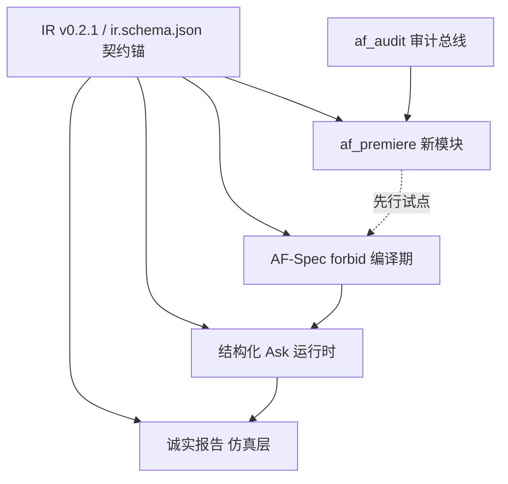

# AutoForge v2 实施路线图

> 状态：**规划稿（评审入口）** · 生成于 2026-09-26 · 来源 `docs/design/v2/` 四篇 MiMo 设计种子。
> 本轮**仅产出路线图，不编写业务代码**。四篇设计稿为独立里程碑，互不直接合并。

## 0 · 全局纪律（四条铁律，落地前必读）

1. **设计种子非成品**：四篇均为 MiMo 生成的设计种子，均被 50,000 字符硬墙收缩，内联代码只含部分函数体 + 签名。**不许按签名猜实现**。
2. **截断件补全纪律**：每篇 §1 标了"被省略符号的原文件起始行"。落地前必须先读真仓源码对行号，把缺的段补全后再写代码。各里程碑的"读真仓清单"见 §3。
3. **IR 唯一真相锚**：凡涉及 IR 字段增删，必须先改 `src/autoforge/af_ir/schema/ir.schema.json`（IR v0.2.1），再改 Python 投影（`af_ir/models.py`）。反过来即违反铁律。
4. **测试由采信台真跑**：四篇均声明"本环境无法执行测试"。里程碑交付代码 + 单测，但 `total/collectable/ran` 三个数必须由**采信台**在真仓实跑得出；路线图中不伪造"已通过"数字。

## 1 · 里程碑总览

顺序按**风险升序 + 接口耦合度升序**排列。M1 为零耦合新模块，先行试水；M2 是编译期硬门，为 M3/M4 的评审前置；M3 改运行时；M4 改报告层。

| 里程碑 | 能力 | 涉及文件 | 耦合度 | 风险 | 先行依赖 |
| --- | --- | --- | --- | --- | --- |
| **M1** | 首演码仪式试演期 | `af_premiere.py`（新） | 零（仅标准库） | 低 | — |
| **M2** | AF-Spec 封闭词表 forbid | `af_spec.py` `af_draft.py` | 编译期 | 中 | — |
| **M3** | 结构化 Ask 协议 | `af_ir/models.py` `af_executor.py` `af_api.py` `af_service.py` `ui/` | 运行时 + 前端 | 高 | M2（硬门先于结构化输入） |
| **M4** | 诚实报告分层 | `af_expect.py` `af_service.py` | 仿真报告层 | 中 | M3（报告依赖运行时仿真链路） |

> **落地状态（2026-09-27）**：M1–M4 的代码与单测均已落地工作区并提交——M3 `0ecced8`（结构化 Ask）+ `3f30f3d`（IR 导出 AskSpec/AskAnswer 补漏）、M1 `af_premiere` 模块 + `af_apply`/`af_audit` 挂接、M4 `0d3fd9e`（诚实报告三栏）、M2 `2ea0f8c`（意图域封闭）。各里程碑验收门本机 `pytest` 均已真跑通过（M1 19 / M2 8(+af_spec forbid) / M3 多文件 / M4 9(+simulate 调用方 33) passed）。按 §4 闸门待 **09-30 变更窗口 + 评审签字**合入主干；文档阶段不部署（§4.3）。

## 2 · 通用落地前置（每个里程碑开工前都要做）

- **真仓位置**：`e:/NAS/AutoForge` 是 NAS 断开副本（net use e: 已断）。真仓源码在 NAS `/vol1/1000/docker/autoforge/src`，UI 在 `/vol1/1000/docker/autoforge/ui`。改完须 `scp` 上 NAS + `docker compose ... up -d` 重建容器才生效（既有部署纪律）。
- **文档阶段不部署**：本轮只写路线图；真部署待 `v1.10.0` 收口且过 **09-30 变更窗口**后，经评审再落地。
- **快照指纹对照**：落地时先核对字节数 / sha256（设计稿给的 2026-09 快照），防副本过期：
  - `af_spec.py` 18,261B · `af_draft.py` 12,250B · `af_ir/models.py` 20,143B · `af_ir/expr.py` 22,854B
  - `af_expect.py` 12,180B · `ir.schema.json` 11,277B · `af_bus.py` 13,097B
- **测试面冲突规避**：每篇 §6 列了"现有测试面"（如 `tests/unit/test_af_premiere.py`）。新增测试函数名要唯一（建议 `test_<milestone>_<场景>` 前缀），**追加合并、不覆盖**既有测试。

## 3 · 各里程碑详设

### M1 · 首演码仪式试演期（`af_premiere`）

- **目标**：部署前一次性 6 位首演码，绑定当前 store diff 的 SHA256（防验码后掉包）+ 5 分钟过期 + 原子消费防重放；部署落地后自动进入试演期（默认 24h）只统计不封禁；assert 失败 / 抖动自动暂停并推送。
- **接口契约（§0 缺口表）**：
  - `af_premiere.issue(store_diff_sha256, ttl_s=300) -> str`（6 位码，返回字符串）
  - `af_premiere.consume(code, store_diff_sha256) -> ConsumeResult`（dict 子类，`ok` + `reason` + `consumed_at`；`__bool__ == ok` 以兼容 `assert result` 与 `result["ok"]` 两种断言）
  - `af_premiere.enter_trial(store_diff_sha256, hours=24)`：进入试演期
  - `report_assert_failure(...)` / `pause_and_notify(pusher)`：`pusher` 可注入回调（WebPush / HTTP），不执行真实封禁
- **设计种子现状**：全新独立模块，仅依赖标准库，**无截断段**。§1 接口面种子为 `ir.schema.json` 与 `af_audit.py`；待挂接的 apply / diff / watch 钩子以"必须照做的形状"给出（非函数体）。
- **读真仓清单（挂接点须对行号确认，非猜）**：
  - `af_pending.py` 的 `apply` 方法（部署落地成功处调用 `enter_trial`）
  - `af_cli.py` 部署入口（签发首演码时机）
  - `af_audit.py` 的 `AuditLog.write(...)` 签名（首演码签发 / 消费 / 试演期暂停事件落审计）
  - store diff SHA256 的计算来源（哪个模块产出"store diff"）
- **§7 待决设计点（落地时逐条拍板并说明理由）**：数据结构与索引选择；失败 / 降级语义（哪些 fail-open、哪些 fail-closed）；原子消费用 `threading.Lock` 内存字典（与 `af_audit` 内存-only 一致，持久化后可换）；是否加每码最大尝试次数（防 6 位码爆破）。
- **验收门**：① issue 返回 6 位码；② 同 sha 调 consume 成功；③ 不同 sha 调 consume 拒绝；④ 过期码 consume 拒绝；⑤ 同一码二次 consume 拒绝（防重放）；⑥ 试演期内注入 1 次 assert 失败 → 触发 `pause_and_notify` 回调（用可注入 fake pusher 验证被调用）；⑦ `tests/unit/test_af_premiere.py` ≥ 15 条单测，且不得出现只断言 `result["ok"] is True` 的空测试。
- **风险 / 依赖**：零现有耦合，风险最低，适合做 v2 第一刀。依赖 M1 自身挂接钩子的真仓行号确认。**建议 PR 边界**：仅新增 `af_premiere.py` + 测试 + `af_pending` / `af_cli` / `af_audit` 三处最小挂接。

### M2 · AF-Spec 封闭词表 forbid

- **目标**：AF-Spec 文本面与意图 JSON 路径强制封闭词表——未知原语 / 未知字段编译前即拒，并返回可机读 `fix` 提示供 Agent 自纠回灌。
- **接口契约（§0 缺口表）**：
  - `SpecError(code="E_UNKNOWN_PRIMITIVE")`：`.fix` 含合法原语清单（在 `compile_spec`，该符号**已被内联**，可直接改）
  - `SpecError(code="E_UNKNOWN_FIELD")`：`.fix` 提示该 key 应删或替换为合法字段
  - `DraftError(code="E_UNKNOWN_DOMAIN")`：`.fix` 给合法域（意图 JSON 未知动作域即拒）
  - `SpecError` / `DraftError` 必带 `.fix`（dict，含 `suggested` / `allowed`）
- **设计种子现状**：收缩件。`af_spec.py` 仅 `_tokenize/_json/_str/_dumps/compile_spec` 有函数体；`af_draft.py` 同样收缩。
- **读真仓清单（§1 明确点名的缺失段，落地前必读）**：
  - `af_spec.py`：`SpecError:51` `_parse_node:173` `_parse_edge:286` `_parse_option:306` `render_spec:346` `_render_automation:352` `_render_node:376` `_render_edge:429` `graph_to_raw:443` `_edge_to_raw:454`（另：模块级路由表 / 正则表整块被省略，需读全文件头）
  - `af_draft.py`：`draft_intent:93` `_resolve_expr:265` `_resolve_do:288`（模块级赋值表整块省略）
  - `ir.schema.json`：作为合法字段 / 原语的唯一真相锚
- **§7 待决设计点**：封闭词表放哪——`E_UNKNOWN_FIELD` 建议在 `compile_spec` 分发前做节点行预检（因 `_parse_node` 体未内联，预检更稳）；`E_UNKNOWN_DOMAIN` 落在 `draft_intent` / `_resolve_do`。是否新增 `af_vocab.py` 集中词表（设计稿倾向不新增，改 `af_spec` / `af_draft`）。
- **验收门**：① 未知原语 → `E_UNKNOWN_PRIMITIVE` 且 `.fix` 给合法清单；② 节点行未知字段 → `E_UNKNOWN_FIELD` 且 `.fix` 给替换建议；③ 意图 JSON 未知域 → `E_UNKNOWN_DOMAIN` 且 `.fix` 给合法域；④ 既有合法 Spec / 意图 JSON 不受影响（回归）；⑤ `tests/unit/test_af_spec.py` + `tests/unit/test_af_draft.py` ≥ 12 条单测。
- **风险 / 依赖**：改编译期，爆炸半径中。是 M3 / M4 的评审硬门（先有 forbid 才有干净的 Agent 输入）。**建议 PR 边界**：`af_spec.py` + `af_draft.py` 最小改动 + 测试；不碰运行时。

### M3 · 结构化 Ask 协议

- **目标**：ask 节点升为一等公民结构化挂起，运行时携带 `AskSpec`（kind∈`choice`/`entity`/`time_range`/`threshold`/`text`）与控件元数据；收敛纪律（连问 ≤ 3 轮、每轮 ≤ 2 问、缺省即拒）由运行时强制；保留旧自由文本路径。
- **接口契约（§0 缺口表）**：
  - `af_ir/models.py` 新增 `AskSpec` 数据类：`kind: str`（枚举校验，非法构造期即拒）、`prompt: str`、`options: list[str]`、`min_` / `max_` / `unit_`（threshold / time_range 用）、`entity_domain: str`（entity 用）
  - `af_executor.Executor`：保留 `answer(room, text, ask_id=None)` 自由文本；新增 `answer(room, AskAnswer, ask_id=None)` 结构化应答；`resolve_ask(ask_id, room) -> AskSession`（含 room / node / prompt / AskSpec）
  - `af_api` / `af_service` 暴露 AskSpec 控件元数据：choice→下拉、time_range→时间轴、threshold→滑杆、entity→实体选择器、text→输入框；`/api/asks` 返回该元数据
  - 收敛纪律：连问 ≤ 3 轮、每轮 ≤ 2 问；剩余不确定项必须落成 ask，不允许默认值脑补（缺省即拒并告警）
- **设计种子现状**：收缩件。`af_ir/models.py` 仅 18 个符号有函数体（含 `Node.from_dict`，AskSpec 加字段可安全改）；`af_executor` / `af_api` / `af_service` **完全未内联**。
- **读真仓清单（§1 点名缺失段）**：
  - `af_ir/models.py`：`Automation:323` `Graph:454` `_schema:478` `validate_automation:482` `load_automation:493` `load_graph:497` `_check_unique_ids:519` `_check_edges:524`
  - `af_ir/expr.py`：`ExprError:53` `_compare:392` `_unary:431` `evaluate:463`
  - `af_bus.py`：`EventBus:108`
  - `af_executor.py` / `af_api.py` / `af_service.py`：**整文件未内联，必须全读**（现有 `answer` 超时 / 房间消歧逻辑不得臆造）
  - `ui/`：Ask 控件原生组件挂载点
- **§7 待决设计点**：`time_range` 的 `min_` / `max_` 语义（建议 minutes-of-day 0–1439，unit 默认 "min"，须标注备选）；`kind` 非法构造期拒；`AskAnswer` 与旧文本路径共存策略；收敛纪律强制位置（运行时 vs executor）。
- **验收门**：① `AskSpec` 各 kind 构造合法 / 非法即拒；② 结构化 `answer` 与自由文本 `answer` 双路径共存；③ `/api/asks` 返回正确控件元数据；④ 连问 > 3 轮或每轮 > 2 问被运行时拦截；⑤ 缺省脑补被拒并告警；⑥ `tests/unit/test_af_executor.py` + `tests/unit/test_af_api.py` 单测（边界全有）。
- **风险 / 依赖**：耦合面最广（IR 模型 + 运行时 + API + 前端），风险最高。**依赖 M2**（结构化输入先过 forbid 硬门）。**建议 PR 边界**：拆 `models.AskSpec`（纯新增，可先于运行时）+ 运行时 `StructuredAskMixin` + API 元数据 + UI 控件，四块可再切子 PR。

### M4 · 诚实报告分层

- **目标**：`forge sim` 报告强制三栏（`verified` / `inferred` / `non_simulable`），不可仿真显式标黄；内核不引入 `do:python` 逃生舱（零 LLM 红线）。
- **接口契约（§0 缺口表）**：
  - `af_service.simulate`（或等价报告构建函数）返回结构固定含 `verified` / `inferred` / `non_simulable` 三个可枚举分区
  - `af_expect` 的 `unverified` 状态动作归入 `non_simulable` 分区且带 `flag="yellow"`
  - 报告里不得出现 python 逃生舱入口（AF 内核纯规则零 LLM）
- **设计种子现状**：`af_expect.py` **完整内联（273 行，逻辑原样照抄，不改）**；`af_service.py` 报告构建点未内联。
- **读真仓清单**：
  - `af_expect.py`：按内联快照原样复用（先核对 sha256 `b93058d7afc4` 一致）
  - `af_service.py`：**整文件未内联，必须全读**；确认 `simulate` 现有返回结构以便"新增分区字段、旧字段不变"（向后兼容或版本化）；若真机已有 `af_service.py`，按**追加合并**不整体覆盖
- **§7 待决设计点**：`verified` 分区含 `pass` 或 `pass+fail`（设计稿建议 `fail` 也入 verified 且标 status，最稳；`unverified`→`non_simulable` 由验收门 4 钉死）；三区"非空"按"分区容器始终存在且可枚举；典型仿真三条均有内容"实现，不为凑数伪造占位（与诚实性主线冲突）；`af_expect` 与 `af_service` 互 import 用防御性 dual import（避免 `MISSING` 哨兵跨副本身份不一致）。
- **验收门**：① 报告结构恒含三分区且均可枚举；② `unverified` 动作落入 `non_simulable` 且 `flag="yellow"`；③ 无 `do:python` 逃生舱入口；④ 旧字段向后兼容（或版本化）；⑤ `tests/unit/test_af_service.py` + `tests/unit/test_af_expect.py` 单测（含"三区均存在且为 list"断言）。
- **风险 / 依赖**：改报告层，风险中。**依赖 M3**（报告依赖运行时仿真链路已就位）。`af_expect.py` 不改，风险可控。**建议 PR 边界**：`af_service.py` 报告面追加 + 测试；`af_expect.py` 仅核对复用。

## 4 · 评审与部署闸门

1. **评审入口**：本路线图 + `docs/design/v2/` 四篇为评审材料。确认顺序 M1→M2→M3→M4。
2. **每里程碑独立 PR**：自包含变更集，互不阻塞；M1 先行合入试水。
3. **部署触发条件**：`v1.10.0` 收口 + 过 09-30 变更窗口 + 采信台真跑测试全绿 + 你评审签字。
4. **不自动合入**：四篇设计种子与本文档均不自动合入 AutoForge 主干（沿用种子纪律）。

## 5 · 真仓快照指纹对照（落地时先核对）

| 文件 | 设计稿快照大小 | sha256（设计稿给） | 落地动作 |
| --- | --- | --- | --- |
| `af_spec.py` | 18,261B | `594c64b9c63b` | 读缺失段后改 |
| `af_draft.py` | 12,250B | `c1aa517377ec` | 读缺失段后改 |
| `af_ir/models.py` | 20,143B | `ba7f76b152ac` | 读缺失段后改（加 AskSpec） |
| `af_ir/expr.py` | 22,854B | `46fcd97d733d` | 读缺失段（M3 参考） |
| `af_expect.py` | 12,180B | `b93058d7afc4` | 原样复用，不改 |
| `ir.schema.json` | 11,277B | `36dfba2eb1e6` | 锚点，M2/M3 涉及字段增删先改它 |
| `af_bus.py` | 13,097B | `ff768e3c6ba1` | 读缺失段（M3 参考） |
| `af_premiere.py` | 不存在（新） | — | M1 新建 |
| `af_executor.py` / `af_api.py` / `af_service.py` | 未内联 | — | M3/M4 必须全读 |

> 注：快照指纹为设计稿 2026-09 采集值；落地时若真仓已演进，以真仓为准并刷新本表。
